# Architecture

## Components

- **Crate**: 39 — see below, `## Crate & Workspace Topology`
- **Document**: 12
- **File**: 2192
- **Person**: 2
- **Pipeline**: 2 — see below, `## CI/CD Pipelines`
- **PythonModule**: 3 — see [API.md](API.md)
- **PythonSymbol**: 3 — see [API.md](API.md)
- **Rollup**: 46 — see below, `## Subsystems`
- **RustModule**: 446 — see [API.md](API.md)
- **RustSymbol**: 1324 — see [API.md](API.md)
- **Section**: 2706
- **Technology**: 36 — see below, `## Technologies`

## Subsystems

_Deterministic rollups (RFC 0044) — one per directory/project group with ≥2 member files, zero LLM. Each links to a detail page with real member counts and boundary relationships, so a subsystem can be understood without walking every file inside it._

- [.serena/cache/rust](entities/rollup/se/serena-cache-rust.md) — 2 member file(s)
- [doc/entities/crate](entities/rollup/do/doc-entities-crate.md) — 39 member file(s)
- [doc/entities/pipeline](entities/rollup/do/doc-entities-pipeline.md) — 2 member file(s)
- [doc/entities/pythonmodule](entities/rollup/do/doc-entities-pythonmodule.md) — 3 member file(s)
- [doc/entities/pythonsymbol](entities/rollup/do/doc-entities-pythonsymbol.md) — 3 member file(s)
- [doc/entities/rustmodule](entities/rollup/do/doc-entities-rustmodule.md) — 446 member file(s)
- [doc/entities/rustsymbol](entities/rollup/do/doc-entities-rustsymbol.md) — 1326 member file(s)
- [doc/entities/technology](entities/rollup/do/doc-entities-technology.md) — 36 member file(s)
- [ekos/crates/artifact](entities/rollup/ek/ekos-crates-artifact.md) — 4 member file(s)
- [ekos/crates/cli](entities/rollup/ek/ekos-crates-cli.md) — 28 member file(s)
- [ekos/crates/common](entities/rollup/ek/ekos-crates-common.md) — 3 member file(s)
- [ekos/crates/compiler-core](entities/rollup/ek/ekos-crates-compiler-core.md) — 8 member file(s)
- [ekos/crates/compiler-sdk](entities/rollup/ek/ekos-crates-compiler-sdk.md) — 2 member file(s)
- [ekos/crates/dbt-gen](entities/rollup/ek/ekos-crates-dbt-gen.md) — 2 member file(s)
- [ekos/crates/docs-gen](entities/rollup/ek/ekos-crates-docs-gen.md) — 2 member file(s)
- [ekos/crates/ekl](entities/rollup/ek/ekos-crates-ekl.md) — 4 member file(s)
- [ekos/crates/identity](entities/rollup/ek/ekos-crates-identity.md) — 4 member file(s)
- [ekos/crates/kir](entities/rollup/ek/ekos-crates-kir.md) — 2 member file(s)
- [ekos/crates/ledger](entities/rollup/ek/ekos-crates-ledger.md) — 9 member file(s)
- [ekos/crates/marketing](entities/rollup/ek/ekos-crates-marketing.md) — 9 member file(s)
- [ekos/crates/observation-sdk](entities/rollup/ek/ekos-crates-observation-sdk.md) — 2 member file(s)
- [ekos/crates/recovery](entities/rollup/ek/ekos-crates-recovery.md) — 23 member file(s)
- [ekos/crates/runtime](entities/rollup/ek/ekos-crates-runtime.md) — 3 member file(s)
- [ekos/crates/scheduler](entities/rollup/ek/ekos-crates-scheduler.md) — 2 member file(s)
- [ekos/crates/semantic](entities/rollup/ek/ekos-crates-semantic.md) — 3 member file(s)
- [ekos/crates/sql-dialect-sdk](entities/rollup/ek/ekos-crates-sql-dialect-sdk.md) — 2 member file(s)
- [ekos/docs/rfcs](entities/rollup/ek/ekos-docs-rfcs.md) — 18 member file(s)
- [ekos/plugins/confluence](entities/rollup/ek/ekos-plugins-confluence.md) — 2 member file(s)
- [ekos/plugins/crypto](entities/rollup/ek/ekos-plugins-crypto.md) — 2 member file(s)
- [ekos/plugins/fabric](entities/rollup/ek/ekos-plugins-fabric.md) — 2 member file(s)
- [ekos/plugins/file](entities/rollup/ek/ekos-plugins-file.md) — 2 member file(s)
- [ekos/plugins/git](entities/rollup/ek/ekos-plugins-git.md) — 2 member file(s)
- [ekos/plugins/github](entities/rollup/ek/ekos-plugins-github.md) — 2 member file(s)
- [ekos/plugins/localdocs](entities/rollup/ek/ekos-plugins-localdocs.md) — 9 member file(s)
- [ekos/plugins/oracle](entities/rollup/ek/ekos-plugins-oracle.md) — 2 member file(s)
- [ekos/plugins/pentaho](entities/rollup/ek/ekos-plugins-pentaho.md) — 2 member file(s)
- [ekos/plugins/python](entities/rollup/ek/ekos-plugins-python.md) — 2 member file(s)
- [ekos/plugins/rust](entities/rollup/ek/ekos-plugins-rust.md) — 2 member file(s)
- [ekos/plugins/salesforce](entities/rollup/ek/ekos-plugins-salesforce.md) — 2 member file(s)
- [ekos/plugins/sap](entities/rollup/ek/ekos-plugins-sap.md) — 2 member file(s)
- [ekos/plugins/snowflake](entities/rollup/ek/ekos-plugins-snowflake.md) — 2 member file(s)
- [ekos/plugins/sql-dialect-databricks](entities/rollup/ek/ekos-plugins-sql-dialect-databricks.md) — 2 member file(s)
- [ekos/plugins/sql-dialect-mssql](entities/rollup/ek/ekos-plugins-sql-dialect-mssql.md) — 2 member file(s)
- [ekos/plugins/sql-dialect-mysql](entities/rollup/ek/ekos-plugins-sql-dialect-mysql.md) — 2 member file(s)
- [ekos/plugins/sql-dialect-postgres](entities/rollup/ek/ekos-plugins-sql-dialect-postgres.md) — 2 member file(s)
- [ekos/plugins/sql-dialect-snowflake](entities/rollup/ek/ekos-plugins-sql-dialect-snowflake.md) — 2 member file(s)

## Crate & Workspace Topology

```mermaid
graph TD
    n20c26e43ee965ee7a04625740fbbd56b["ekos-benchmark"]
    n8806bf5463645052b85acef4344e8f19["ekos-artifact"]
    n20c26e43ee965ee7a04625740fbbd56b -->|DependsOn| n8806bf5463645052b85acef4344e8f19
    n2690bc0d0233516fb9699e87432f623d["ekos-compiler-core"]
    n20c26e43ee965ee7a04625740fbbd56b -->|DependsOn| n2690bc0d0233516fb9699e87432f623d
    n2c6b8d9a83ed510ea5d8a76f2e8685fe["ekos-identity"]
    n20c26e43ee965ee7a04625740fbbd56b -->|DependsOn| n2c6b8d9a83ed510ea5d8a76f2e8685fe
    n7e3bc0ded88855cdaa9af333f6e2cbb2["ekos-kir"]
    n20c26e43ee965ee7a04625740fbbd56b -->|DependsOn| n7e3bc0ded88855cdaa9af333f6e2cbb2
    n9c977335c421519ca889558f0487574e["ekos-ledger"]
    n20c26e43ee965ee7a04625740fbbd56b -->|DependsOn| n9c977335c421519ca889558f0487574e
    n9a955a3a55bc587a942dfb81d6260052["ekos-observation-sdk"]
    n20c26e43ee965ee7a04625740fbbd56b -->|DependsOn| n9a955a3a55bc587a942dfb81d6260052
    ndf977fc8e004518eb267581520ccd448["ekos-plugin-git"]
    n20c26e43ee965ee7a04625740fbbd56b -->|DependsOn| ndf977fc8e004518eb267581520ccd448
    n28244ebb4e165e8da6375e750d01f2b8["ekos-recovery"]
    n20c26e43ee965ee7a04625740fbbd56b -->|DependsOn| n28244ebb4e165e8da6375e750d01f2b8
    nf4cd2d3bf0b05234ab2b39de3275d717["ekos-runtime"]
    n20c26e43ee965ee7a04625740fbbd56b -->|DependsOn| nf4cd2d3bf0b05234ab2b39de3275d717
    nf82d9ce0df2a5af89f9a2bd5f8484839["ekos-semantic"]
    n20c26e43ee965ee7a04625740fbbd56b -->|DependsOn| nf82d9ce0df2a5af89f9a2bd5f8484839
    n063808f95f195d62b3dd69eaa93d44cb["ekos-integration-tests"]
    nabd31cd9b31d54c587cd8a4a5b9a30a0["ekos"]
    n063808f95f195d62b3dd69eaa93d44cb -->|DependsOn| nabd31cd9b31d54c587cd8a4a5b9a30a0
    n063808f95f195d62b3dd69eaa93d44cb -->|DependsOn| n2690bc0d0233516fb9699e87432f623d
    n063808f95f195d62b3dd69eaa93d44cb -->|DependsOn| n9c977335c421519ca889558f0487574e
    n063808f95f195d62b3dd69eaa93d44cb -->|DependsOn| nf4cd2d3bf0b05234ab2b39de3275d717
    n2c6b8d9a83ed510ea5d8a76f2e8685fe -->|DependsOn| n7e3bc0ded88855cdaa9af333f6e2cbb2
    nf82d9ce0df2a5af89f9a2bd5f8484839 -->|DependsOn| n8806bf5463645052b85acef4344e8f19
    ndc169f0a98f15c7c8dd01dbc8504e9c9["ekos-common"]
    nf82d9ce0df2a5af89f9a2bd5f8484839 -->|DependsOn| ndc169f0a98f15c7c8dd01dbc8504e9c9
    nf82d9ce0df2a5af89f9a2bd5f8484839 -->|DependsOn| n2690bc0d0233516fb9699e87432f623d
    nf82d9ce0df2a5af89f9a2bd5f8484839 -->|DependsOn| n2c6b8d9a83ed510ea5d8a76f2e8685fe
    nf82d9ce0df2a5af89f9a2bd5f8484839 -->|DependsOn| n7e3bc0ded88855cdaa9af333f6e2cbb2
    nf4cd2d3bf0b05234ab2b39de3275d717 -->|DependsOn| n2690bc0d0233516fb9699e87432f623d
    nf4cd2d3bf0b05234ab2b39de3275d717 -->|DependsOn| n7e3bc0ded88855cdaa9af333f6e2cbb2
    nf4cd2d3bf0b05234ab2b39de3275d717 -->|DependsOn| n9c977335c421519ca889558f0487574e
    nf4cd2d3bf0b05234ab2b39de3275d717 -->|DependsOn| n28244ebb4e165e8da6375e750d01f2b8
    n2690bc0d0233516fb9699e87432f623d -->|DependsOn| n8806bf5463645052b85acef4344e8f19
    n2690bc0d0233516fb9699e87432f623d -->|DependsOn| ndc169f0a98f15c7c8dd01dbc8504e9c9
    n2690bc0d0233516fb9699e87432f623d -->|DependsOn| n7e3bc0ded88855cdaa9af333f6e2cbb2
    n7e3bc0ded88855cdaa9af333f6e2cbb2 -->|DependsOn| ndc169f0a98f15c7c8dd01dbc8504e9c9
    nabd31cd9b31d54c587cd8a4a5b9a30a0 -->|DependsOn| n8806bf5463645052b85acef4344e8f19
    nabd31cd9b31d54c587cd8a4a5b9a30a0 -->|DependsOn| ndc169f0a98f15c7c8dd01dbc8504e9c9
    nabd31cd9b31d54c587cd8a4a5b9a30a0 -->|DependsOn| n2690bc0d0233516fb9699e87432f623d
    n9b66a043a00958d6b44620001b04c706["ekos-dbt-gen"]
    nabd31cd9b31d54c587cd8a4a5b9a30a0 -->|DependsOn| n9b66a043a00958d6b44620001b04c706
    nee66e2d3bd7f53c2a9f97dcb7cba59b3["ekos-docs-gen"]
    nabd31cd9b31d54c587cd8a4a5b9a30a0 -->|DependsOn| nee66e2d3bd7f53c2a9f97dcb7cba59b3
    nd932eaf470695419a00cfa4b7b374c86["ekos-ekl"]
    nabd31cd9b31d54c587cd8a4a5b9a30a0 -->|DependsOn| nd932eaf470695419a00cfa4b7b374c86
    nabd31cd9b31d54c587cd8a4a5b9a30a0 -->|DependsOn| n2c6b8d9a83ed510ea5d8a76f2e8685fe
    nabd31cd9b31d54c587cd8a4a5b9a30a0 -->|DependsOn| n7e3bc0ded88855cdaa9af333f6e2cbb2
    nabd31cd9b31d54c587cd8a4a5b9a30a0 -->|DependsOn| n9c977335c421519ca889558f0487574e
    n18dba45d95345035bd6fdf6b370079ac["ekos-marketing"]
    nabd31cd9b31d54c587cd8a4a5b9a30a0 -->|DependsOn| n18dba45d95345035bd6fdf6b370079ac
    nabd31cd9b31d54c587cd8a4a5b9a30a0 -->|DependsOn| n9a955a3a55bc587a942dfb81d6260052
    ne8d1a3c9e7b25084bdfc569e7b604054["ekos-plugin-confluence"]
    nabd31cd9b31d54c587cd8a4a5b9a30a0 -->|DependsOn| ne8d1a3c9e7b25084bdfc569e7b604054
    n835d6e675bb053e79104338881612548["ekos-plugin-crypto"]
    nabd31cd9b31d54c587cd8a4a5b9a30a0 -->|DependsOn| n835d6e675bb053e79104338881612548
    n06b65958abb75fe1a6eed35946d39062["ekos-plugin-file"]
    nabd31cd9b31d54c587cd8a4a5b9a30a0 -->|DependsOn| n06b65958abb75fe1a6eed35946d39062
    nabd31cd9b31d54c587cd8a4a5b9a30a0 -->|DependsOn| ndf977fc8e004518eb267581520ccd448
    naff4d491b33f56d7b0bae03e884983fd["ekos-plugin-github"]
    nabd31cd9b31d54c587cd8a4a5b9a30a0 -->|DependsOn| naff4d491b33f56d7b0bae03e884983fd
    n0659fbf3d2f454ba835fa7f6f875a7d1["ekos-plugin-localdocs"]
    nabd31cd9b31d54c587cd8a4a5b9a30a0 -->|DependsOn| n0659fbf3d2f454ba835fa7f6f875a7d1
    ndac1d743a50e57a98acb56e29a47ef5e["ekos-plugin-pentaho"]
    nabd31cd9b31d54c587cd8a4a5b9a30a0 -->|DependsOn| ndac1d743a50e57a98acb56e29a47ef5e
    n020c78caf337542fb3518b4201393bbb["ekos-plugin-python"]
    nabd31cd9b31d54c587cd8a4a5b9a30a0 -->|DependsOn| n020c78caf337542fb3518b4201393bbb
    n07179babd4865b148c686e743e45b3f6["ekos-plugin-rust"]
    nabd31cd9b31d54c587cd8a4a5b9a30a0 -->|DependsOn| n07179babd4865b148c686e743e45b3f6
    nabd31cd9b31d54c587cd8a4a5b9a30a0 -->|DependsOn| n28244ebb4e165e8da6375e750d01f2b8
    nabd31cd9b31d54c587cd8a4a5b9a30a0 -->|DependsOn| nf4cd2d3bf0b05234ab2b39de3275d717
    nabd31cd9b31d54c587cd8a4a5b9a30a0 -->|DependsOn| nf82d9ce0df2a5af89f9a2bd5f8484839
    n9a955a3a55bc587a942dfb81d6260052 -->|DependsOn| n8806bf5463645052b85acef4344e8f19
    n9a955a3a55bc587a942dfb81d6260052 -->|DependsOn| ndc169f0a98f15c7c8dd01dbc8504e9c9
    n7bea4b92902b50728b4f740613d85745["ekos-compiler-sdk"]
    n7bea4b92902b50728b4f740613d85745 -->|DependsOn| n2690bc0d0233516fb9699e87432f623d
    n8806bf5463645052b85acef4344e8f19 -->|DependsOn| ndc169f0a98f15c7c8dd01dbc8504e9c9
    n8806bf5463645052b85acef4344e8f19 -->|DependsOn| n7e3bc0ded88855cdaa9af333f6e2cbb2
    n9b66a043a00958d6b44620001b04c706 -->|DependsOn| n7e3bc0ded88855cdaa9af333f6e2cbb2
    n18dba45d95345035bd6fdf6b370079ac -->|DependsOn| n2690bc0d0233516fb9699e87432f623d
    n18dba45d95345035bd6fdf6b370079ac -->|DependsOn| n28244ebb4e165e8da6375e750d01f2b8
    n2053b72d2c1851e486cdc9a252fd7f89["ekos-scheduler"]
    n2053b72d2c1851e486cdc9a252fd7f89 -->|DependsOn| n2690bc0d0233516fb9699e87432f623d
    nd932eaf470695419a00cfa4b7b374c86 -->|DependsOn| n7e3bc0ded88855cdaa9af333f6e2cbb2
    nd932eaf470695419a00cfa4b7b374c86 -->|DependsOn| nf4cd2d3bf0b05234ab2b39de3275d717
    nee66e2d3bd7f53c2a9f97dcb7cba59b3 -->|DependsOn| n7e3bc0ded88855cdaa9af333f6e2cbb2
    n28244ebb4e165e8da6375e750d01f2b8 -->|DependsOn| n8806bf5463645052b85acef4344e8f19
    n28244ebb4e165e8da6375e750d01f2b8 -->|DependsOn| ndc169f0a98f15c7c8dd01dbc8504e9c9
    n28244ebb4e165e8da6375e750d01f2b8 -->|DependsOn| n2690bc0d0233516fb9699e87432f623d
    n28244ebb4e165e8da6375e750d01f2b8 -->|DependsOn| n7e3bc0ded88855cdaa9af333f6e2cbb2
    n920f420348d45079a5ee41b212c4858c["ekos-plugin-sql-dialect-databricks"]
    n28244ebb4e165e8da6375e750d01f2b8 -->|DependsOn| n920f420348d45079a5ee41b212c4858c
    n05ad9d89d39c5316b4132903b6b557db["ekos-plugin-sql-dialect-mssql"]
    n28244ebb4e165e8da6375e750d01f2b8 -->|DependsOn| n05ad9d89d39c5316b4132903b6b557db
    n001696e194795c36ae5308898760049d["ekos-plugin-sql-dialect-mysql"]
    n28244ebb4e165e8da6375e750d01f2b8 -->|DependsOn| n001696e194795c36ae5308898760049d
    nff9a3a7c06105442ac0b210e45700aad["ekos-plugin-sql-dialect-postgres"]
    n28244ebb4e165e8da6375e750d01f2b8 -->|DependsOn| nff9a3a7c06105442ac0b210e45700aad
    n15989d4959f8564ea77dc90d2d87c80b["ekos-plugin-sql-dialect-snowflake"]
    n28244ebb4e165e8da6375e750d01f2b8 -->|DependsOn| n15989d4959f8564ea77dc90d2d87c80b
    n28244ebb4e165e8da6375e750d01f2b8 -->|DependsOn| nf82d9ce0df2a5af89f9a2bd5f8484839
    nbf4371bd7cee54d1945706a1079a38cf["ekos-sql-dialect-sdk"]
    n28244ebb4e165e8da6375e750d01f2b8 -->|DependsOn| nbf4371bd7cee54d1945706a1079a38cf
    n9c977335c421519ca889558f0487574e -->|DependsOn| n8806bf5463645052b85acef4344e8f19
    n9c977335c421519ca889558f0487574e -->|DependsOn| ndc169f0a98f15c7c8dd01dbc8504e9c9
    n9c977335c421519ca889558f0487574e -->|DependsOn| n7e3bc0ded88855cdaa9af333f6e2cbb2
    n05ad9d89d39c5316b4132903b6b557db -->|DependsOn| nbf4371bd7cee54d1945706a1079a38cf
    n66e4bdc107c65f6e9150d6db731cf29d["ekos-plugin-oracle"]
    n66e4bdc107c65f6e9150d6db731cf29d -->|DependsOn| n8806bf5463645052b85acef4344e8f19
    n66e4bdc107c65f6e9150d6db731cf29d -->|DependsOn| ndc169f0a98f15c7c8dd01dbc8504e9c9
    n66e4bdc107c65f6e9150d6db731cf29d -->|DependsOn| n9a955a3a55bc587a942dfb81d6260052
    ne8d1a3c9e7b25084bdfc569e7b604054 -->|DependsOn| n8806bf5463645052b85acef4344e8f19
    ne8d1a3c9e7b25084bdfc569e7b604054 -->|DependsOn| ndc169f0a98f15c7c8dd01dbc8504e9c9
    ne8d1a3c9e7b25084bdfc569e7b604054 -->|DependsOn| n9a955a3a55bc587a942dfb81d6260052
    n0659fbf3d2f454ba835fa7f6f875a7d1 -->|DependsOn| n8806bf5463645052b85acef4344e8f19
    n0659fbf3d2f454ba835fa7f6f875a7d1 -->|DependsOn| ndc169f0a98f15c7c8dd01dbc8504e9c9
    n0659fbf3d2f454ba835fa7f6f875a7d1 -->|DependsOn| n9a955a3a55bc587a942dfb81d6260052
    n870bf8c45212524ca4426fe561baf29d["ekos-plugin-sap"]
    n870bf8c45212524ca4426fe561baf29d -->|DependsOn| n8806bf5463645052b85acef4344e8f19
    n870bf8c45212524ca4426fe561baf29d -->|DependsOn| ndc169f0a98f15c7c8dd01dbc8504e9c9
    n870bf8c45212524ca4426fe561baf29d -->|DependsOn| n9a955a3a55bc587a942dfb81d6260052
    naff4d491b33f56d7b0bae03e884983fd -->|DependsOn| n8806bf5463645052b85acef4344e8f19
    naff4d491b33f56d7b0bae03e884983fd -->|DependsOn| ndc169f0a98f15c7c8dd01dbc8504e9c9
    naff4d491b33f56d7b0bae03e884983fd -->|DependsOn| n9a955a3a55bc587a942dfb81d6260052
    ndac1d743a50e57a98acb56e29a47ef5e -->|DependsOn| n8806bf5463645052b85acef4344e8f19
    ndac1d743a50e57a98acb56e29a47ef5e -->|DependsOn| ndc169f0a98f15c7c8dd01dbc8504e9c9
    ndac1d743a50e57a98acb56e29a47ef5e -->|DependsOn| n9a955a3a55bc587a942dfb81d6260052
    n06b65958abb75fe1a6eed35946d39062 -->|DependsOn| n8806bf5463645052b85acef4344e8f19
    n06b65958abb75fe1a6eed35946d39062 -->|DependsOn| ndc169f0a98f15c7c8dd01dbc8504e9c9
    n06b65958abb75fe1a6eed35946d39062 -->|DependsOn| n9a955a3a55bc587a942dfb81d6260052
    n920f420348d45079a5ee41b212c4858c -->|DependsOn| nbf4371bd7cee54d1945706a1079a38cf
    n020c78caf337542fb3518b4201393bbb -->|DependsOn| n8806bf5463645052b85acef4344e8f19
    n020c78caf337542fb3518b4201393bbb -->|DependsOn| ndc169f0a98f15c7c8dd01dbc8504e9c9
    n020c78caf337542fb3518b4201393bbb -->|DependsOn| n9a955a3a55bc587a942dfb81d6260052
    nff9a3a7c06105442ac0b210e45700aad -->|DependsOn| nbf4371bd7cee54d1945706a1079a38cf
    ndf977fc8e004518eb267581520ccd448 -->|DependsOn| n8806bf5463645052b85acef4344e8f19
    ndf977fc8e004518eb267581520ccd448 -->|DependsOn| ndc169f0a98f15c7c8dd01dbc8504e9c9
    ndf977fc8e004518eb267581520ccd448 -->|DependsOn| n9a955a3a55bc587a942dfb81d6260052
    naeb0688d1d0058a5b6d6245dfefa74cf["ekos-plugin-fabric"]
    naeb0688d1d0058a5b6d6245dfefa74cf -->|DependsOn| n8806bf5463645052b85acef4344e8f19
    naeb0688d1d0058a5b6d6245dfefa74cf -->|DependsOn| ndc169f0a98f15c7c8dd01dbc8504e9c9
    naeb0688d1d0058a5b6d6245dfefa74cf -->|DependsOn| n9a955a3a55bc587a942dfb81d6260052
    n0a005794329c5fc3a395a5c55cf9cfcb["ekos-plugin-snowflake"]
    n0a005794329c5fc3a395a5c55cf9cfcb -->|DependsOn| n8806bf5463645052b85acef4344e8f19
    n0a005794329c5fc3a395a5c55cf9cfcb -->|DependsOn| ndc169f0a98f15c7c8dd01dbc8504e9c9
    n0a005794329c5fc3a395a5c55cf9cfcb -->|DependsOn| n9a955a3a55bc587a942dfb81d6260052
    na9e38433d55055238c134f5c31f4e742["ekos-plugin-salesforce"]
    na9e38433d55055238c134f5c31f4e742 -->|DependsOn| n8806bf5463645052b85acef4344e8f19
    na9e38433d55055238c134f5c31f4e742 -->|DependsOn| ndc169f0a98f15c7c8dd01dbc8504e9c9
    na9e38433d55055238c134f5c31f4e742 -->|DependsOn| n9a955a3a55bc587a942dfb81d6260052
    n835d6e675bb053e79104338881612548 -->|DependsOn| n8806bf5463645052b85acef4344e8f19
    n835d6e675bb053e79104338881612548 -->|DependsOn| ndc169f0a98f15c7c8dd01dbc8504e9c9
    n835d6e675bb053e79104338881612548 -->|DependsOn| n9a955a3a55bc587a942dfb81d6260052
    n001696e194795c36ae5308898760049d -->|DependsOn| nbf4371bd7cee54d1945706a1079a38cf
    n15989d4959f8564ea77dc90d2d87c80b -->|DependsOn| nbf4371bd7cee54d1945706a1079a38cf
    n07179babd4865b148c686e743e45b3f6 -->|DependsOn| n8806bf5463645052b85acef4344e8f19
    n07179babd4865b148c686e743e45b3f6 -->|DependsOn| ndc169f0a98f15c7c8dd01dbc8504e9c9
    n07179babd4865b148c686e743e45b3f6 -->|DependsOn| n9a955a3a55bc587a942dfb81d6260052
```

## Technologies

- **serde_json** — used by: ekos-benchmark, ekos-identity, ekos-semantic, ekos-runtime, ekos-compiler-core, ekos-kir, ekos, ekos-observation-sdk, ekos-artifact, ekos-dbt-gen, ekos-common, ekos-marketing, ekos-ekl, ekos-docs-gen, ekos-recovery, ekos-ledger, ekos-plugin-oracle, ekos-plugin-confluence, ekos-plugin-localdocs, ekos-plugin-sap, ekos-plugin-github, ekos-plugin-pentaho, ekos-plugin-file, ekos-plugin-python, ekos-plugin-git, ekos-plugin-fabric, ekos-plugin-snowflake, ekos-plugin-salesforce, ekos-plugin-crypto, ekos-plugin-rust
- **sqlparser** — used by: ekos-benchmark, ekos-sql-dialect-sdk, ekos-recovery, ekos-plugin-sql-dialect-mssql, ekos-plugin-sql-dialect-databricks, ekos-plugin-sql-dialect-postgres, ekos-plugin-sql-dialect-mysql, ekos-plugin-sql-dialect-snowflake
- **tempfile** — used by: ekos-benchmark, ekos-integration-tests, ekos-plugin-localdocs
- **tokio** — used by: ekos-benchmark, ekos-integration-tests, ekos-compiler-core, ekos, ekos-observation-sdk, ekos-marketing, ekos-recovery, ekos-plugin-oracle, ekos-plugin-confluence, ekos-plugin-localdocs, ekos-plugin-sap, ekos-plugin-github, ekos-plugin-pentaho, ekos-plugin-file, ekos-plugin-python, ekos-plugin-git, ekos-plugin-fabric, ekos-plugin-snowflake, ekos-plugin-salesforce, ekos-plugin-crypto, ekos-plugin-rust
- **uuid** — used by: ekos-benchmark, ekos-semantic, ekos-kir, ekos, ekos-artifact, ekos-common, ekos-marketing, ekos-recovery, ekos-ledger, ekos-plugin-crypto
- **anyhow** — used by: ekos-integration-tests, ekos-compiler-core, ekos, ekos-marketing, ekos-recovery
- **thiserror** — used by: ekos-identity, ekos-semantic, ekos-runtime, ekos-compiler-core, ekos-kir, ekos-observation-sdk, ekos-artifact, ekos-common, ekos-marketing, ekos-ekl, ekos-recovery, ekos-ledger, ekos-plugin-oracle, ekos-plugin-confluence, ekos-plugin-localdocs, ekos-plugin-sap, ekos-plugin-github, ekos-plugin-pentaho, ekos-plugin-file, ekos-plugin-python, ekos-plugin-git, ekos-plugin-fabric, ekos-plugin-snowflake, ekos-plugin-salesforce, ekos-plugin-crypto, ekos-plugin-rust
- **async-trait** — used by: ekos-semantic, ekos-runtime, ekos-compiler-core, ekos-observation-sdk, ekos-marketing, ekos-recovery, ekos-plugin-oracle, ekos-plugin-confluence, ekos-plugin-localdocs, ekos-plugin-sap, ekos-plugin-github, ekos-plugin-pentaho, ekos-plugin-file, ekos-plugin-python, ekos-plugin-git, ekos-plugin-fabric, ekos-plugin-snowflake, ekos-plugin-salesforce, ekos-plugin-crypto, ekos-plugin-rust
- **chrono** — used by: ekos-semantic, ekos-runtime, ekos-compiler-core, ekos-kir, ekos, ekos-observation-sdk, ekos-artifact, ekos-common, ekos-marketing, ekos-recovery, ekos-ledger, ekos-plugin-git, ekos-plugin-crypto
- **tracing** — used by: ekos-semantic, ekos-compiler-core, ekos, ekos-artifact, ekos-marketing, ekos-recovery, ekos-ledger, ekos-plugin-oracle, ekos-plugin-confluence, ekos-plugin-localdocs, ekos-plugin-sap, ekos-plugin-github, ekos-plugin-pentaho, ekos-plugin-file, ekos-plugin-python, ekos-plugin-git, ekos-plugin-fabric, ekos-plugin-snowflake, ekos-plugin-salesforce, ekos-plugin-crypto, ekos-plugin-rust
- **hex** — used by: ekos-compiler-core, ekos-observation-sdk, ekos-artifact, ekos-common, ekos-recovery, ekos-ledger, ekos-plugin-localdocs, ekos-plugin-pentaho, ekos-plugin-file, ekos-plugin-python, ekos-plugin-rust
- **sha2** — used by: ekos-compiler-core, ekos-observation-sdk, ekos-artifact, ekos-common, ekos-marketing, ekos-recovery, ekos-ledger, ekos-plugin-localdocs, ekos-plugin-pentaho, ekos-plugin-file, ekos-plugin-python, ekos-plugin-rust
- **toml** — used by: ekos-compiler-core, ekos, ekos-recovery
- **walkdir** — used by: ekos-compiler-core, ekos, ekos-observation-sdk, ekos-plugin-localdocs, ekos-plugin-pentaho, ekos-plugin-file, ekos-plugin-python, ekos-plugin-rust
- **clap** — used by: ekos
- **dotenvy** — used by: ekos
- **zstd** — used by: ekos-artifact, ekos-common, ekos-ledger
- **base64** — used by: ekos-marketing
- **hmac** — used by: ekos-marketing
- **percent-encoding** — used by: ekos-marketing
- **rand** — used by: ekos-marketing
- **reqwest** — used by: ekos-marketing, ekos-recovery, ekos-plugin-confluence, ekos-plugin-sap, ekos-plugin-github, ekos-plugin-fabric, ekos-plugin-snowflake, ekos-plugin-salesforce
- **glob** — used by: ekos-recovery
- **roxmltree** — used by: ekos-recovery
- **rustpython-ast** — used by: ekos-recovery
- **syn** — used by: ekos-recovery
- **memmap2** — used by: ekos-ledger
- **rusqlite** — used by: ekos-ledger
- **tantivy** — used by: ekos-ledger
- **docx-rs** — used by: ekos-plugin-localdocs
- **html2text** — used by: ekos-plugin-localdocs
- **lopdf** — used by: ekos-plugin-localdocs
- **mail-parser** — used by: ekos-plugin-localdocs
- **pdf-extract** — used by: ekos-plugin-localdocs
- **zip** — used by: ekos-plugin-localdocs
- **parquet** — used by: ekos-plugin-crypto

## CI/CD Pipelines

### Deploy Pages

Triggers: `push`, `workflow_dispatch`

- **deploy**
  - actions/checkout@v7
  - actions/upload-pages-artifact@v3
  - actions/deploy-pages@v4

### CI

Triggers: `push`, `pull_request`

- **build-and-test**
  - actions/checkout@v7
  - Install Rust stable
  - Cache cargo registry
  - Build (all crates)
  - Test (unit + integration)
  - Clippy (no warnings)
  - Format check
- **benchmark**
  - actions/checkout@v7
  - Install Rust stable
  - Cache cargo registry
  - Run benchmarks
  - Upload benchmark report

## Entity Relationships

_No table foreign-key relationships compiled._

## Dependency Graph

### Calls

_749 `Calls` relationships compiled — diagram omitted, too large to render usefully. First 15 shown below; every object's own detail page (linked) lists its full relationship set._

- [GitHubApiClient::list_files](entities/rustsymbol/gi/githubapiclient-list-files.md) → [GitHubApiClient::request](entities/rustsymbol/gi/githubapiclient-request.md)
- [GitHubApiClient::list_items](entities/rustsymbol/gi/githubapiclient-list-items.md) → [GitHubApiClient::list_files](entities/rustsymbol/gi/githubapiclient-list-files.md)
- [GitHubApiClient::list_items](entities/rustsymbol/gi/githubapiclient-list-items.md) → [GitHubApiClient::request](entities/rustsymbol/gi/githubapiclient-request.md)
- [PythonAnalyzerPass::run](entities/rustsymbol/py/pythonanalyzerpass-run.md) → [parse_python_file](entities/rustsymbol/pa/parse-python-file.md)
- [parse_python_file](entities/rustsymbol/pa/parse-python-file.md) → [walk_top_level_statement](entities/rustsymbol/wa/walk-top-level-statement.md)
- [add_import](entities/rustsymbol/ad/add-import-89c6ca8d.md) → [python_module_kir_id](entities/rustsymbol/py/python-module-kir-id.md)
- [walk_top_level_statement](entities/rustsymbol/wa/walk-top-level-statement.md) → [add_symbol](entities/rustsymbol/ad/add-symbol-458e9ef2.md)
- [walk_top_level_statement](entities/rustsymbol/wa/walk-top-level-statement.md) → [add_import](entities/rustsymbol/ad/add-import-89c6ca8d.md)
- [walk_top_level_statement](entities/rustsymbol/wa/walk-top-level-statement.md) → [try_recognize_chain_statement](entities/rustsymbol/tr/try-recognize-chain-statement.md)
- [try_recognize_chain_statement](entities/rustsymbol/tr/try-recognize-chain-statement.md) → [calls_to_nodes](entities/rustsymbol/ca/calls-to-nodes.md)
- [try_recognize_chain_statement](entities/rustsymbol/tr/try-recognize-chain-statement.md) → [linearize_chain](entities/rustsymbol/li/linearize-chain.md)
- [linearize_chain](entities/rustsymbol/li/linearize-chain.md) → [linearize_chain](entities/rustsymbol/li/linearize-chain.md)
- [join_keys_from_on](entities/rustsymbol/jo/join-keys-from-on.md) → [keyword_arg](entities/rustsymbol/ke/keyword-arg.md)
- [join_keys_from_on](entities/rustsymbol/jo/join-keys-from-on.md) → [string_constant](entities/rustsymbol/st/string-constant.md)
- [join_kind_from_how](entities/rustsymbol/jo/join-kind-from-how.md) → [keyword_arg](entities/rustsymbol/ke/keyword-arg.md)

### Contains

_6065 `Contains` relationships compiled — diagram omitted, too large to render usefully. First 15 shown below; every object's own detail page (linked) lists its full relationship set._

- docs/rfcs/0022-confluence-connector.md → doc/entities/rustsymbol/ma/main.md: section 1
- docs/rfcs/0022-confluence-connector.md → doc/entities/rustsymbol/va/validate-tweet.md: section 1
- docs/rfcs/0022-confluence-connector.md → doc/entities/rustsymbol/ll/llmerror.md: section 1
- docs/rfcs/0022-confluence-connector.md → doc/entities/rustsymbol/di/dir-bytes.md: section 1
- docs/rfcs/0022-confluence-connector.md → doc/entities/crate/ek/ekos-plugin-fabric.md: section 1
- docs/rfcs/0022-confluence-connector.md → doc/entities/crate/ek/ekos-plugin-fabric.md: section 2
- docs/rfcs/0022-confluence-connector.md → doc/entities/rustsymbol/pa/parse-sql-statement-by-statement.md: section 1
- docs/rfcs/0022-confluence-connector.md → doc/entities/rustsymbol/ki/kirobject-indexed-content.md: section 1
- docs/rfcs/0022-confluence-connector.md → doc/entities/rustsymbol/at/attributeregistry-get.md: section 1
- docs/rfcs/0022-confluence-connector.md → doc/entities/rustmodule/cr/crate-prompt-build-user-prompt.md: section 1
- docs/rfcs/0022-confluence-connector.md → doc/entities/rustmodule/cr/crate-parseddocument.md: section 1
- VISION.md → VISION.md: section 1
- VISION.md → VISION.md: section 2
- VISION.md → VISION.md: section 3
- docs/rfcs/0022-confluence-connector.md → doc/entities/rustsymbol/pa/passcontext-with-artifact-store.md: section 1

### CoupledWith

_372 `CoupledWith` relationships compiled — diagram omitted, too large to render usefully. First 15 shown below; every object's own detail page (linked) lists its full relationship set._

- ekos/crates/cli/src/commands/recover.rs → ekos/plugins/localdocs/src/lib.rs
- demo/DEMO.md → demo/transcripts/act-2.md
- TODO.md → devlog_18.md
- ekos/Cargo.toml → ekos/crates/ledger/src/lib.rs
- TODO.md → ekos/crates/recovery/src/sql_analyzer.rs
- ekos/crates/cli/src/commands/compile.rs → ekos/crates/cli/src/commands/recover.rs
- README.md → docs/index.html
- README.md → ekos/Cargo.toml
- demo/transcripts/act-2.md → demo/transcripts/act-7.md
- ekos/crates/recovery/Cargo.toml → ekos/crates/recovery/src/sql_transform_analyzer.rs
- ekos/crates/cli/src/commands/mcp.rs → ekos/crates/semantic/src/lib.rs
- ekos/crates/cli/src/commands/build.rs → ekos/plugins/file/src/lib.rs
- ekos/plugins/salesforce/src/lib.rs → ekos/plugins/snowflake/src/lib.rs
- ekos/Cargo.lock → ekos/plugins/localdocs/Cargo.toml
- ekos/crates/cli/Cargo.toml → ekos/crates/cli/src/commands/mod.rs

### DependsOn

_1666 `DependsOn` relationships compiled — diagram omitted, too large to render usefully. First 15 shown below; every object's own detail page (linked) lists its full relationship set._

- ekos/plugins/github/src/lib.rs → [async_trait::async_trait](entities/rustmodule/as/async-trait-async-trait.md)
- ekos/plugins/github/src/lib.rs → [ekos_artifact::ObservationArtifact](entities/rustmodule/ek/ekos-artifact-observationartifact.md)
- ekos/plugins/github/src/lib.rs → [ekos_observation_sdk::ObservationPackage](entities/rustmodule/ek/ekos-observation-sdk-observationpackage.md)
- ekos/plugins/github/src/lib.rs → [ekos_observation_sdk::ObserveError](entities/rustmodule/ek/ekos-observation-sdk-observeerror.md)
- ekos/plugins/github/src/lib.rs → [ekos_observation_sdk::Observer](entities/rustmodule/ek/ekos-observation-sdk-observer.md)
- ekos/plugins/github/src/lib.rs → [ekos_observation_sdk::ScanContext](entities/rustmodule/ek/ekos-observation-sdk-scancontext.md)
- ekos/plugins/github/src/lib.rs → [serde::Deserialize](entities/rustmodule/se/serde-deserialize.md)
- ekos/plugins/github/src/lib.rs → [serde::Serialize](entities/rustmodule/se/serde-serialize.md)
- ekos/plugins/github/src/lib.rs → [std::sync::Arc](entities/rustmodule/st/std-sync-arc.md)
- ekos/plugins/github/src/lib.rs → [thiserror::Error](entities/rustmodule/th/thiserror-error.md)
- ekos/crates/recovery/src/python_analyzer.rs → [async_trait::async_trait](entities/rustmodule/as/async-trait-async-trait.md)
- ekos/crates/recovery/src/python_analyzer.rs → [ekos_artifact::ArtifactId](entities/rustmodule/ek/ekos-artifact-artifactid.md)
- ekos/crates/recovery/src/python_analyzer.rs → [ekos_compiler_core::pass::CompilerPass](entities/rustmodule/ek/ekos-compiler-core-pass-compilerpass.md)
- ekos/crates/recovery/src/python_analyzer.rs → [ekos_compiler_core::pass::PassContext](entities/rustmodule/ek/ekos-compiler-core-pass-passcontext.md)
- ekos/crates/recovery/src/python_analyzer.rs → [ekos_compiler_core::pass::PassError](entities/rustmodule/ek/ekos-compiler-core-pass-passerror.md)

### OwnedBy

_105 `OwnedBy` relationships compiled — diagram omitted, too large to render usefully. First 15 shown below; every object's own detail page (linked) lists its full relationship set._

- unknown → alexeyban
- unknown → alexeyban
- unknown → alexeyban
- unknown → alexeyban
- unknown → alexeyban
- unknown → alexeyban
- unknown → alexeyban
- unknown → alexeyban
- unknown → alexeyban
- unknown → alexeyban
- unknown → alexeyban
- unknown → alexeyban
- unknown → alexeyban
- unknown → alexeyban
- unknown → alexeyban

