# Sequence Diagrams

## Data-Flow Sequences

_Rendered from Transformation IR `FeedsInto` edges — a data-flow sequence between compiled pipeline steps, not a code call sequence._

_No transformation pipelines compiled._

## Call Sequences

_Rendered from real `Calls` edges (function/method call graph, RFC 0041) — grouped by the caller's containing module. A genuine code call sequence, distinct from the data-flow sequences above._

### benchmark/benches/fact_ledger.rs

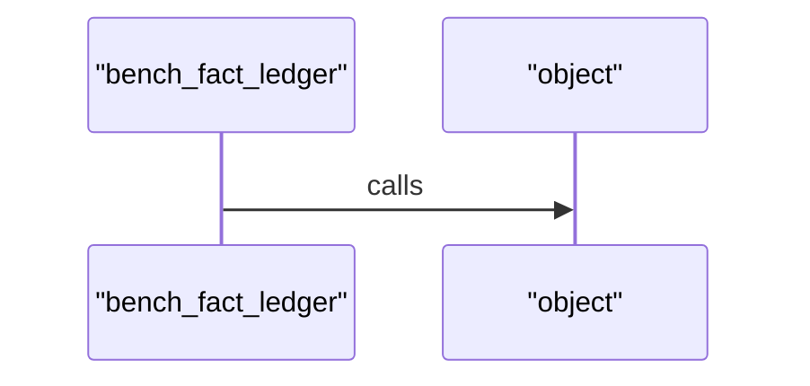

### benchmark/benches/fact_model.rs

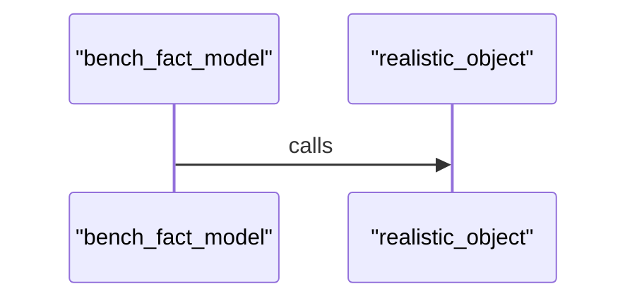

### benchmark/benches/identity_resolver.rs

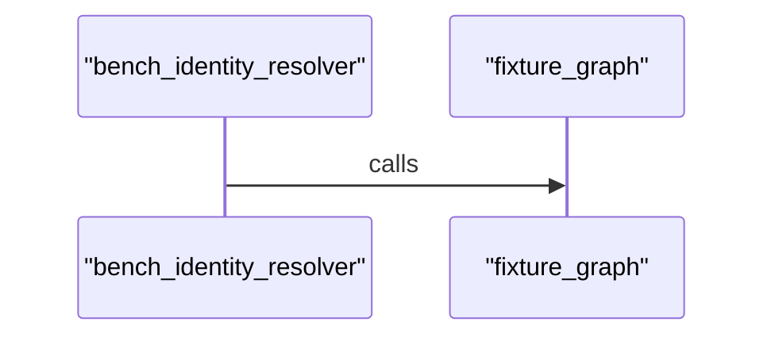

### benchmark/benches/index_runs.rs

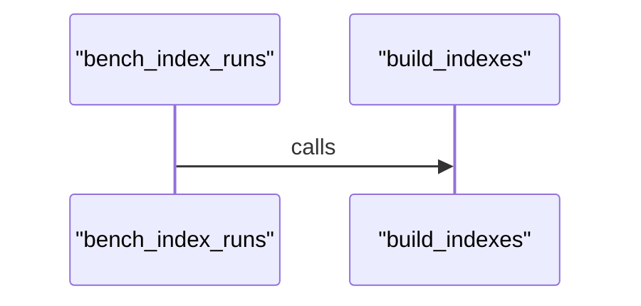

### benchmark/benches/observation_git.rs

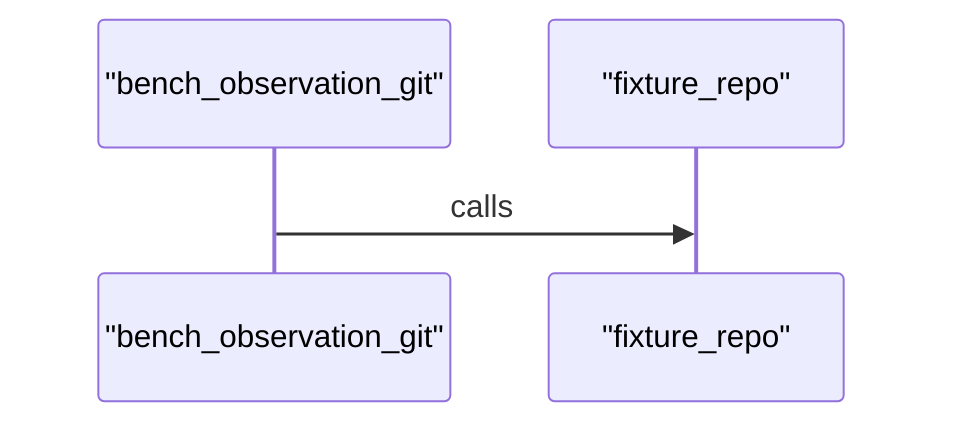

### benchmark/benches/runtime_load_neighborhood.rs

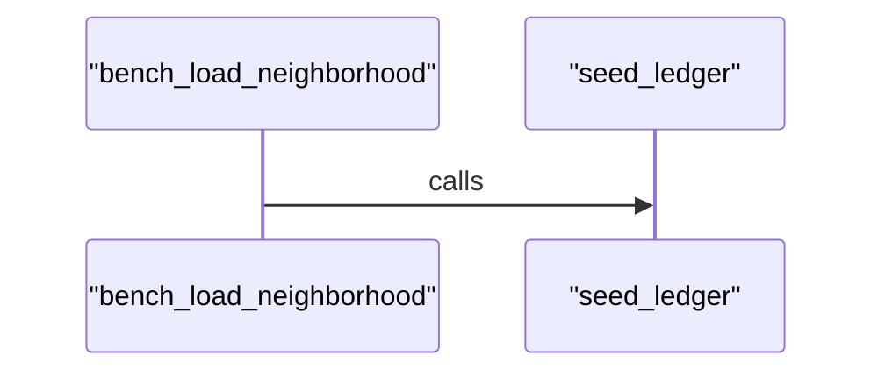

### benchmark/benches/segment_store.rs

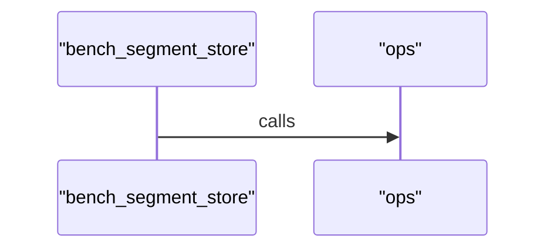

### benchmark/benches/semantic_compiler.rs

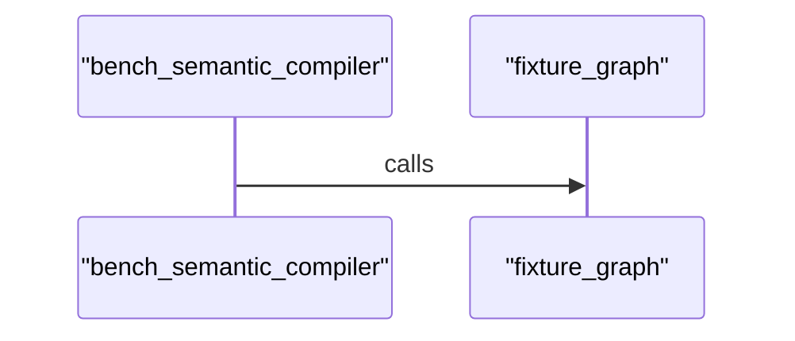

### benchmark/benches/storage_compaction.rs

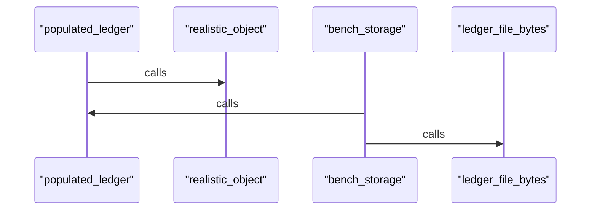

### ekos/crates/artifact/src/lib.rs

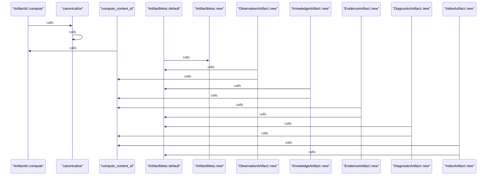

### ekos/crates/artifact/src/pack.rs

_22 `Calls` edges compiled for this module — diagram omitted, too large to render usefully._

### ekos/crates/artifact/src/store.rs

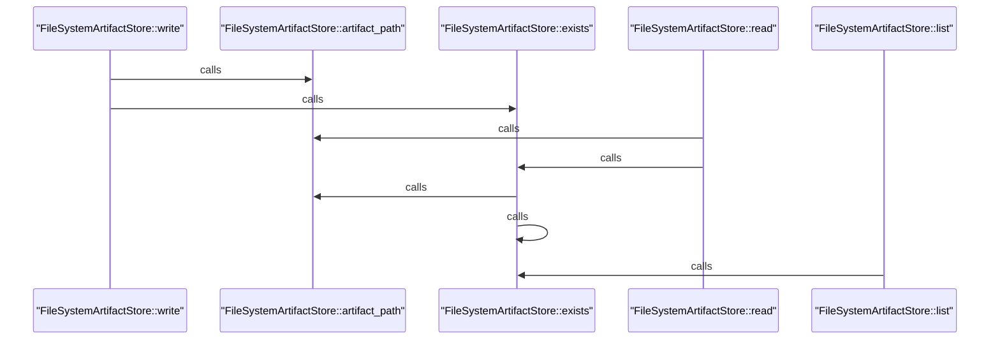

### ekos/crates/cli/src/commands/ask.rs

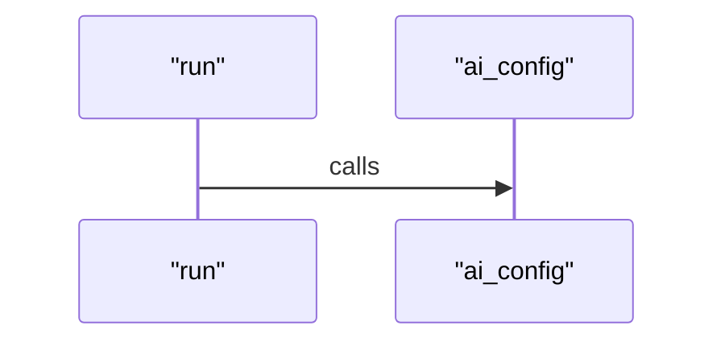

### ekos/crates/cli/src/commands/branch.rs

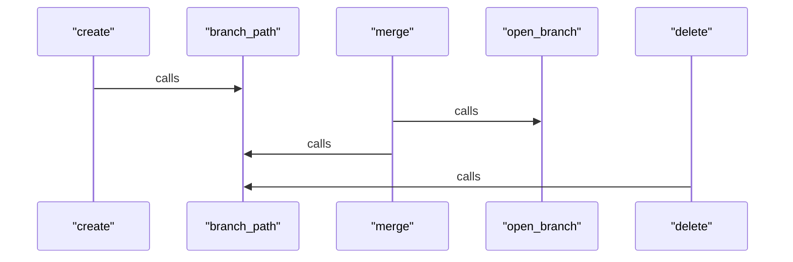

### ekos/crates/cli/src/commands/build.rs

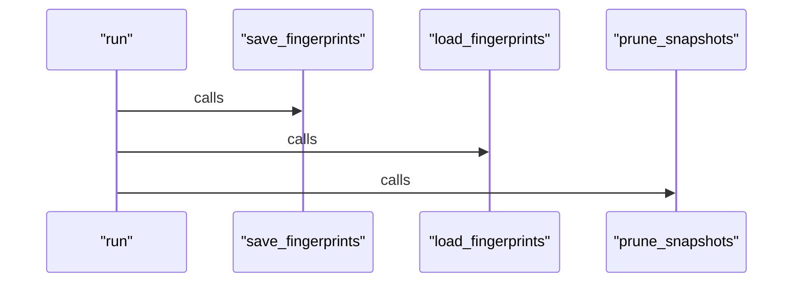

### ekos/crates/cli/src/commands/commit.rs

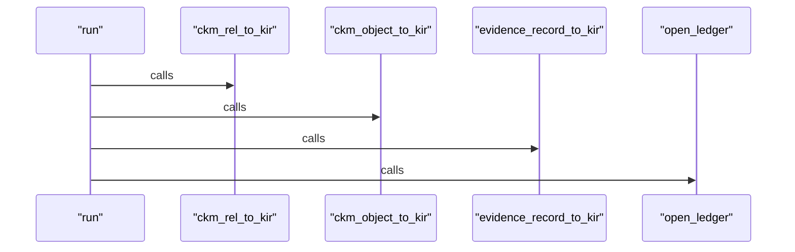

### ekos/crates/cli/src/commands/compile.rs

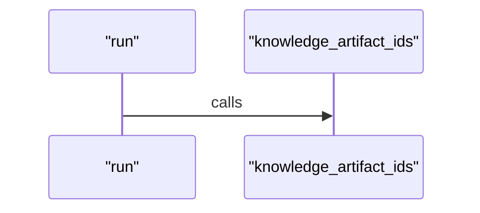

### ekos/crates/cli/src/commands/dbt.rs

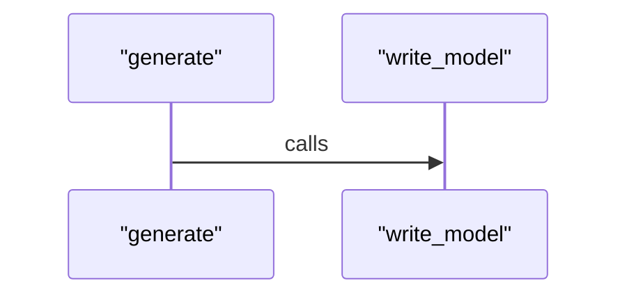

### ekos/crates/cli/src/commands/docs.rs

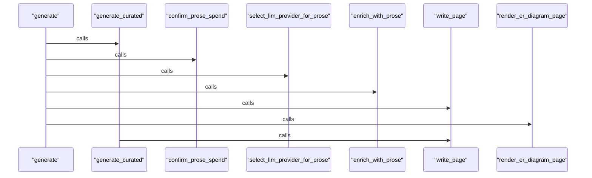

### ekos/crates/cli/src/commands/doctor.rs

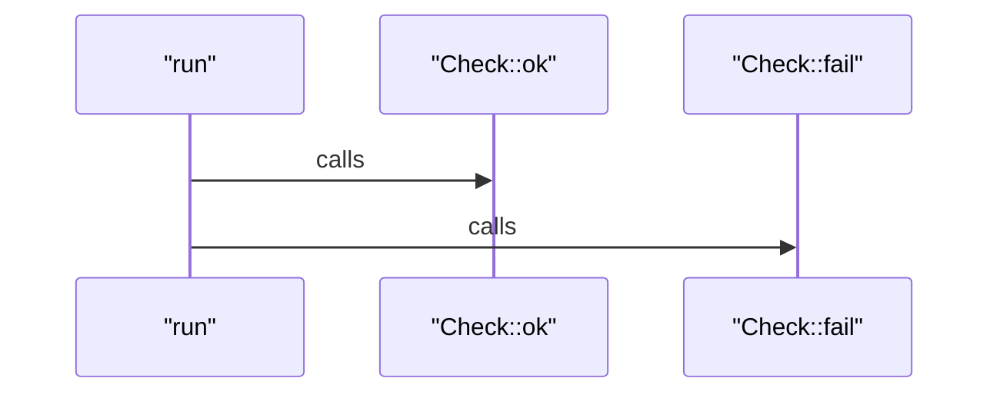

### ekos/crates/cli/src/commands/ledger.rs

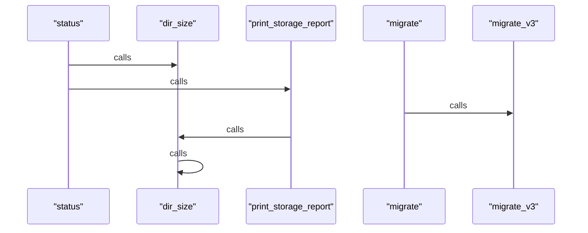

### ekos/crates/cli/src/commands/marketing.rs

```mermaid
sequenceDiagram
    participant ne7c2f511275951deb835a5aa57064c4f as "publish"
    participant n8cf1b866178a5ca7b5dd40b1aa8e7de7 as "resolve_devlog_path"
    participant n9b3a010569f6541dab3c6c9ae99908ff as "log_line"
    participant n824776cf10305c02acf6961e14b329e1 as "select_llm_provider"
    participant n76efc638276d5610966b18f8fc582a09 as "approve"
    ne7c2f511275951deb835a5aa57064c4f->>n8cf1b866178a5ca7b5dd40b1aa8e7de7: calls
    ne7c2f511275951deb835a5aa57064c4f->>n9b3a010569f6541dab3c6c9ae99908ff: calls
    ne7c2f511275951deb835a5aa57064c4f->>n824776cf10305c02acf6961e14b329e1: calls
    ne7c2f511275951deb835a5aa57064c4f->>n76efc638276d5610966b18f8fc582a09: calls
```

### ekos/crates/cli/src/commands/mcp.rs

```mermaid
sequenceDiagram
    participant n6891f75cd8b956a39f17a6ae5a79a3b7 as "run"
    participant n98d3a1757e2f5ae182edc0036ee6a6f5 as "handle_message"
    participant n75923916379c5b98a9b4c4b9264c6d2d as "ok_response"
    participant n6e38d86221345ff9917b9c7c56f49a8e as "error_response"
    participant n45c28e0c51c3541d899dfdef70b6efb8 as "initialize_result"
    participant n524402504db85d198d69bf98b9de4bd1 as "tools_call"
    participant n0e48bbfe32495440a944a03fcd474757 as "call_tool"
    participant nfc9051fdc6d95f7496465a2260a739f1 as "transformation_chain"
    participant n0ebfd1d7051f56b49112e5305fb697e3 as "explain_node"
    participant nd8d4e4a86e9d5b6da699fe2d97a8071c as "required_id"
    participant n34ebe6e367295e55a0e8f85730f2eb99 as "required_str"
    participant n750bae0db9bf5689a59ab667bb555db9 as "diff_chains"
    participant n265648c299ce59f8936986d9653d0ccb as "node_comparable"
    n6891f75cd8b956a39f17a6ae5a79a3b7->>n98d3a1757e2f5ae182edc0036ee6a6f5: calls
    n98d3a1757e2f5ae182edc0036ee6a6f5->>n75923916379c5b98a9b4c4b9264c6d2d: calls
    n98d3a1757e2f5ae182edc0036ee6a6f5->>n6e38d86221345ff9917b9c7c56f49a8e: calls
    n98d3a1757e2f5ae182edc0036ee6a6f5->>n45c28e0c51c3541d899dfdef70b6efb8: calls
    n98d3a1757e2f5ae182edc0036ee6a6f5->>n524402504db85d198d69bf98b9de4bd1: calls
    n524402504db85d198d69bf98b9de4bd1->>n0e48bbfe32495440a944a03fcd474757: calls
    n0e48bbfe32495440a944a03fcd474757->>nfc9051fdc6d95f7496465a2260a739f1: calls
    n0e48bbfe32495440a944a03fcd474757->>n0ebfd1d7051f56b49112e5305fb697e3: calls
    n0e48bbfe32495440a944a03fcd474757->>nd8d4e4a86e9d5b6da699fe2d97a8071c: calls
    n0e48bbfe32495440a944a03fcd474757->>n34ebe6e367295e55a0e8f85730f2eb99: calls
    n750bae0db9bf5689a59ab667bb555db9->>n265648c299ce59f8936986d9653d0ccb: calls
    nd8d4e4a86e9d5b6da699fe2d97a8071c->>n34ebe6e367295e55a0e8f85730f2eb99: calls
```

### ekos/crates/cli/src/commands/query.rs

```mermaid
sequenceDiagram
    participant nb6e1ea7faebd56bca79e36c75bad4b97 as "object"
    participant nfce4a499441057f5a2a6cb2313a5b8a9 as "open_ledger"
    participant n9ae5ed64d6e6597d9bfc0db3de66d004 as "find"
    participant n62eadfcc59315f83b1dc841406bcf8ae as "neighbourhood"
    nb6e1ea7faebd56bca79e36c75bad4b97->>nfce4a499441057f5a2a6cb2313a5b8a9: calls
    n9ae5ed64d6e6597d9bfc0db3de66d004->>nfce4a499441057f5a2a6cb2313a5b8a9: calls
    n62eadfcc59315f83b1dc841406bcf8ae->>nfce4a499441057f5a2a6cb2313a5b8a9: calls
```

### ekos/crates/cli/src/commands/recover.rs

```mermaid
sequenceDiagram
    participant n786d52250ff95fff99f92f5d73858f4a as "run"
    participant na83c0280990b556cb3750073c876d6af as "build_llm_provider"
    participant n56a3b0e71cb15f189df7efc98e4101ea as "collect_git_artifact_ids"
    participant n0b2fc479d8da54ca969377523aa07f09 as "collect_github_artifact_ids"
    participant n474da60918e5510787b2e73fc37fc787 as "should_register_document_semantics"
    participant n4be5dd1369c554619846b55f29c40344 as "collect_localdocs_artifact_ids"
    participant n831dd074421950b5aebb5d99e3558e4d as "collect_rust_artifact_ids"
    participant n06cf6e29711c5b58949fe8676b97964e as "collect_pentaho_artifact_ids"
    participant nbbd7195e79995c519ff2ec42bdfd3e44 as "collect_crypto_artifact_ids"
    participant nca09688ef94c5ba29780d3ebdc04f0e9 as "collect_confluence_artifact_ids"
    participant n37874b81bb325d9989578edf985f969f as "collect_python_artifact_ids"
    n786d52250ff95fff99f92f5d73858f4a->>na83c0280990b556cb3750073c876d6af: calls
    n786d52250ff95fff99f92f5d73858f4a->>n56a3b0e71cb15f189df7efc98e4101ea: calls
    n786d52250ff95fff99f92f5d73858f4a->>n0b2fc479d8da54ca969377523aa07f09: calls
    n786d52250ff95fff99f92f5d73858f4a->>n474da60918e5510787b2e73fc37fc787: calls
    n786d52250ff95fff99f92f5d73858f4a->>n4be5dd1369c554619846b55f29c40344: calls
    n786d52250ff95fff99f92f5d73858f4a->>n831dd074421950b5aebb5d99e3558e4d: calls
    n786d52250ff95fff99f92f5d73858f4a->>n06cf6e29711c5b58949fe8676b97964e: calls
    n786d52250ff95fff99f92f5d73858f4a->>nbbd7195e79995c519ff2ec42bdfd3e44: calls
    n786d52250ff95fff99f92f5d73858f4a->>nca09688ef94c5ba29780d3ebdc04f0e9: calls
    n786d52250ff95fff99f92f5d73858f4a->>n37874b81bb325d9989578edf985f969f: calls
```

### ekos/crates/cli/src/commands/resolve.rs

```mermaid
sequenceDiagram
    participant ne9261342f9a3557d8a83a4d1d1159682 as "run"
    participant n9e49b8832e8950e9ac09960ffefbd612 as "merge_into"
    ne9261342f9a3557d8a83a4d1d1159682->>n9e49b8832e8950e9ac09960ffefbd612: calls
```

### ekos/crates/cli/src/commands/store.rs

```mermaid
sequenceDiagram
    participant n10d67e5ac7545199915e23349038a6f5 as "uses_fact_engine"
    participant n83873731f1485047ad68b92b7feef390 as "facts_dir"
    participant nce911a52305556e0bea7c15a5ff1d773 as "open_store"
    participant n713ed7cc5c75533e89bc0a3cd1e3b880 as "store_display"
    n10d67e5ac7545199915e23349038a6f5->>n83873731f1485047ad68b92b7feef390: calls
    nce911a52305556e0bea7c15a5ff1d773->>n83873731f1485047ad68b92b7feef390: calls
    nce911a52305556e0bea7c15a5ff1d773->>n10d67e5ac7545199915e23349038a6f5: calls
    n713ed7cc5c75533e89bc0a3cd1e3b880->>n83873731f1485047ad68b92b7feef390: calls
    n713ed7cc5c75533e89bc0a3cd1e3b880->>n10d67e5ac7545199915e23349038a6f5: calls
```

### ekos/crates/cli/tests/mcp_session.rs

```mermaid
sequenceDiagram
    participant na0f174d3a1ae5c3886aa9920ae2beb45 as "claude_code_session_over_mcp"
    participant n60facea1f0855fb69750725533dae17f as "setup_workspace"
    participant n467babc25a36596888d48cd2204b2f95 as "load_config"
    participant n79df7d9c60b95b0c82a08fea3e18a0a0 as "call_tool"
    na0f174d3a1ae5c3886aa9920ae2beb45->>n60facea1f0855fb69750725533dae17f: calls
    na0f174d3a1ae5c3886aa9920ae2beb45->>n467babc25a36596888d48cd2204b2f95: calls
    na0f174d3a1ae5c3886aa9920ae2beb45->>n79df7d9c60b95b0c82a08fea3e18a0a0: calls
```

### ekos/crates/cli/tests/skeleton.rs

```mermaid
sequenceDiagram
    participant n83a765f710045a659fda0e393a6a043b as "init_creates_ekos_directory"
    participant nf8f102adbfb458548fb62200db5a7daf as "setup_workspace"
    participant nd1e71ee34e17505081bd5dd6a8cafafe as "load_config"
    participant n8381b3cfb4ab5e24b22325b1e3647ee2 as "build_observes_files_and_writes_ledger"
    participant n41345ca495295fa7994e937f12f58595 as "query_object_returns_known_file"
    participant n05d0403048875de2ab44dff63a787efd as "build_is_idempotent"
    participant nc8408593f6d85b7083013485d093719e as "clean_removes_artifacts_not_ledger"
    n83a765f710045a659fda0e393a6a043b->>nf8f102adbfb458548fb62200db5a7daf: calls
    n83a765f710045a659fda0e393a6a043b->>nd1e71ee34e17505081bd5dd6a8cafafe: calls
    n8381b3cfb4ab5e24b22325b1e3647ee2->>nd1e71ee34e17505081bd5dd6a8cafafe: calls
    n8381b3cfb4ab5e24b22325b1e3647ee2->>nf8f102adbfb458548fb62200db5a7daf: calls
    n41345ca495295fa7994e937f12f58595->>nd1e71ee34e17505081bd5dd6a8cafafe: calls
    n41345ca495295fa7994e937f12f58595->>nf8f102adbfb458548fb62200db5a7daf: calls
    n05d0403048875de2ab44dff63a787efd->>nf8f102adbfb458548fb62200db5a7daf: calls
    n05d0403048875de2ab44dff63a787efd->>nd1e71ee34e17505081bd5dd6a8cafafe: calls
    nc8408593f6d85b7083013485d093719e->>nf8f102adbfb458548fb62200db5a7daf: calls
    nc8408593f6d85b7083013485d093719e->>nd1e71ee34e17505081bd5dd6a8cafafe: calls
```

### ekos/crates/cli/tests/transformation_benchmark.rs

```mermaid
sequenceDiagram
    participant n145f01d3407353caa5a60bd6ebdbdb45 as "phase7_benchmark_recover_explain_diff_over_mcp_only"
    participant nc16a7ca309be58b0be2c7ec5f46b0f15 as "load_config"
    participant na762a492344253ed993e68a448c9584b as "call_tool"
    participant ne8ff1e4b762557dabfa2e10ecf154d62 as "setup_workspace"
    n145f01d3407353caa5a60bd6ebdbdb45->>nc16a7ca309be58b0be2c7ec5f46b0f15: calls
    n145f01d3407353caa5a60bd6ebdbdb45->>na762a492344253ed993e68a448c9584b: calls
    n145f01d3407353caa5a60bd6ebdbdb45->>ne8ff1e4b762557dabfa2e10ecf154d62: calls
```

### ekos/crates/common/src/compress.rs

```mermaid
sequenceDiagram
    participant n8727a5c8cc9553b6a4f68ed58f001a79 as "resolve_auto"
    participant neddec3cb1d3e52188af73692a9d8531d as "zst_sibling"
    participant nd2c994b8f8ac565db197a798dd05cf96 as "read_json_auto"
    participant n1567b100c49950688613ef76e744a280 as "read_json_zst"
    n8727a5c8cc9553b6a4f68ed58f001a79->>neddec3cb1d3e52188af73692a9d8531d: calls
    nd2c994b8f8ac565db197a798dd05cf96->>n1567b100c49950688613ef76e744a280: calls
    nd2c994b8f8ac565db197a798dd05cf96->>neddec3cb1d3e52188af73692a9d8531d: calls
```

### ekos/crates/common/src/lib.rs

```mermaid
sequenceDiagram
    participant n9b9fe50ee94f5ba1ba809f24ca5b0d91 as "ContentHash::of_str"
    participant nf98ad3b08c495e709509e9ef3a9e6561 as "ContentHash::of"
    n9b9fe50ee94f5ba1ba809f24ca5b0d91->>nf98ad3b08c495e709509e9ef3a9e6561: calls
```

### ekos/crates/compiler-core/src/cache.rs

```mermaid
sequenceDiagram
    participant nbc8bc6d94904570ca03219abf84603ab as "should_recompute"
    participant naa7a9c528f6750f6a1eb13a372078457 as "manifest_path"
    participant n67114ad5cda05d8094440bf9047d0ecc as "record_manifest"
    nbc8bc6d94904570ca03219abf84603ab->>naa7a9c528f6750f6a1eb13a372078457: calls
    n67114ad5cda05d8094440bf9047d0ecc->>naa7a9c528f6750f6a1eb13a372078457: calls
```

### ekos/crates/compiler-core/src/compiler.rs

```mermaid
sequenceDiagram
    participant ne99254af76a152b0beeedd8fa3c21077 as "Compiler::run"
    ne99254af76a152b0beeedd8fa3c21077->>ne99254af76a152b0beeedd8fa3c21077: calls
```

### ekos/crates/compiler-core/src/config.rs

```mermaid
sequenceDiagram
    participant n86487b2d47d65105807b404b12767a95 as "WorkspaceConfig::default"
    participant n7b4baf1da71f5879b16260a8f58bb004 as "default_root"
    participant n08ad7fde95bd5d738bc48cb5a70b8fd9 as "default_log_format"
    participant n09665155ef9e5259b3798452b328264d as "default_log_level"
    participant ndb53c97e788e587ba5d4fbff7497f34e as "ObserveConfig::default"
    participant n8365dc187a685b6cbb0bfcddf13ef488 as "default_ignore_patterns"
    participant n3fa1fe515c40500ea4afe9b3dfeb907f as "MarketingConfig::default"
    participant n81f7cad33ade55cba07f9d2c85cbcc12 as "default_github"
    participant n88f766d2969355798cf3a2624f967bc2 as "default_hashtags"
    participant nfe38f3bea4fa5373ba201201a822e6d3 as "SqlRecoverConfig::default"
    participant n45785f2021e05b649864611d05aa98b7 as "default_sql_dialect"
    participant n96f3be9497615db0b99a0c705c9c55d0 as "EkosConfig::default"
    participant n5c036ac3203e5c5988f2d79a35ccf921 as "EkosConfig::from_file_or_default"
    participant n6c6a765c3f26501e8d3a8393454e9273 as "EkosConfig::from_file"
    participant n40a21a837f2459519ce3be90d0e89682 as "EkosConfig::artifact_dir"
    participant n2ae501da572c53d984c5837ab91b23f9 as "EkosConfig::ekos_dir"
    participant n3356e33800e25af6ae588eab5122377b as "EkosConfig::ledger_dir"
    participant n07b8455917ba5a9b9464d009a63af093 as "EkosConfig::ledger_path"
    participant nb05f3338a437555aa05036a4731498a1 as "EkosConfig::branch_ledger_path"
    n86487b2d47d65105807b404b12767a95->>n7b4baf1da71f5879b16260a8f58bb004: calls
    n86487b2d47d65105807b404b12767a95->>n08ad7fde95bd5d738bc48cb5a70b8fd9: calls
    n86487b2d47d65105807b404b12767a95->>n09665155ef9e5259b3798452b328264d: calls
    ndb53c97e788e587ba5d4fbff7497f34e->>n8365dc187a685b6cbb0bfcddf13ef488: calls
    n3fa1fe515c40500ea4afe9b3dfeb907f->>n81f7cad33ade55cba07f9d2c85cbcc12: calls
    n3fa1fe515c40500ea4afe9b3dfeb907f->>n88f766d2969355798cf3a2624f967bc2: calls
    nfe38f3bea4fa5373ba201201a822e6d3->>n45785f2021e05b649864611d05aa98b7: calls
    n96f3be9497615db0b99a0c705c9c55d0->>n3fa1fe515c40500ea4afe9b3dfeb907f: calls
    n96f3be9497615db0b99a0c705c9c55d0->>n86487b2d47d65105807b404b12767a95: calls
    n96f3be9497615db0b99a0c705c9c55d0->>ndb53c97e788e587ba5d4fbff7497f34e: calls
    n5c036ac3203e5c5988f2d79a35ccf921->>n6c6a765c3f26501e8d3a8393454e9273: calls
    n5c036ac3203e5c5988f2d79a35ccf921->>n96f3be9497615db0b99a0c705c9c55d0: calls
    n40a21a837f2459519ce3be90d0e89682->>n2ae501da572c53d984c5837ab91b23f9: calls
    n3356e33800e25af6ae588eab5122377b->>n2ae501da572c53d984c5837ab91b23f9: calls
    n07b8455917ba5a9b9464d009a63af093->>n3356e33800e25af6ae588eab5122377b: calls
    nb05f3338a437555aa05036a4731498a1->>n3356e33800e25af6ae588eab5122377b: calls
```

### ekos/crates/compiler-core/src/diagnostics.rs

```mermaid
sequenceDiagram
    participant ne6093eeac3f95894b146d449ee5b6f84 as "DiagnosticSink::error"
    participant nba8ffc803c115877bbd3a465cd305be4 as "DiagnosticSink::emit"
    participant nb50ccff773775f32a71cc1aa3f5895db as "Diagnostic::error"
    participant n24645a2fef1f5a55b6fdb94baf480fb0 as "DiagnosticSink::warning"
    participant nef3705958fee58e29dfba62ab3481d89 as "Diagnostic::warning"
    participant n07782ac5d68754d6b6b82aa02ac02499 as "DiagnosticSink::info"
    participant n50b0b84a7b745f94837842ae38261000 as "Diagnostic::info"
    ne6093eeac3f95894b146d449ee5b6f84->>nba8ffc803c115877bbd3a465cd305be4: calls
    ne6093eeac3f95894b146d449ee5b6f84->>nb50ccff773775f32a71cc1aa3f5895db: calls
    n24645a2fef1f5a55b6fdb94baf480fb0->>nba8ffc803c115877bbd3a465cd305be4: calls
    n24645a2fef1f5a55b6fdb94baf480fb0->>nef3705958fee58e29dfba62ab3481d89: calls
    n07782ac5d68754d6b6b82aa02ac02499->>n50b0b84a7b745f94837842ae38261000: calls
    n07782ac5d68754d6b6b82aa02ac02499->>nba8ffc803c115877bbd3a465cd305be4: calls
```

### ekos/crates/compiler-core/src/pass.rs

```mermaid
sequenceDiagram
    participant n35af390358195ec3939611a8a343a41c as "PassManager::is_empty"
    participant n621f7d1a9bff502d9e321f7cbefd68e8 as "PassManager::len"
    participant n523e017fa17a520e925d295f0abfb465 as "PassManager::check_unique_names"
    participant n293e83a5d93e54cf957a3cc539a369fe as "PassManager::execution_order"
    participant n3e578779ba09580a9d6d8319115114de as "PassManager::run_all"
    participant n5b7ff059a0b154d791b16fd5a3bbfe85 as "PassManager::execution_levels"
    participant nf64251fc07c75863b0060419e9c2f655 as "PassManager::run_all_parallel"
    participant nc4a39ee90abd58b5b650aa1f99ead86c as "PassManager::default"
    participant nd6d716a59b995556bde53d655c5ebc5b as "PassManager::new"
    n35af390358195ec3939611a8a343a41c->>n35af390358195ec3939611a8a343a41c: calls
    n621f7d1a9bff502d9e321f7cbefd68e8->>n621f7d1a9bff502d9e321f7cbefd68e8: calls
    n523e017fa17a520e925d295f0abfb465->>n621f7d1a9bff502d9e321f7cbefd68e8: calls
    n293e83a5d93e54cf957a3cc539a369fe->>n523e017fa17a520e925d295f0abfb465: calls
    n293e83a5d93e54cf957a3cc539a369fe->>n621f7d1a9bff502d9e321f7cbefd68e8: calls
    n3e578779ba09580a9d6d8319115114de->>n293e83a5d93e54cf957a3cc539a369fe: calls
    n5b7ff059a0b154d791b16fd5a3bbfe85->>n35af390358195ec3939611a8a343a41c: calls
    n5b7ff059a0b154d791b16fd5a3bbfe85->>n523e017fa17a520e925d295f0abfb465: calls
    n5b7ff059a0b154d791b16fd5a3bbfe85->>n621f7d1a9bff502d9e321f7cbefd68e8: calls
    nf64251fc07c75863b0060419e9c2f655->>n5b7ff059a0b154d791b16fd5a3bbfe85: calls
    nc4a39ee90abd58b5b650aa1f99ead86c->>nd6d716a59b995556bde53d655c5ebc5b: calls
```

### ekos/crates/compiler-core/src/scheduler.rs

```mermaid
sequenceDiagram
    participant nee947ba6f1675999b7968cdaa2f16bdc as "Scheduler::register"
    nee947ba6f1675999b7968cdaa2f16bdc->>nee947ba6f1675999b7968cdaa2f16bdc: calls
```

### ekos/crates/dbt-gen/src/lib.rs

_26 `Calls` edges compiled for this module — diagram omitted, too large to render usefully._

### ekos/crates/docs-gen/src/lib.rs

_32 `Calls` edges compiled for this module — diagram omitted, too large to render usefully._

### ekos/crates/ekl/src/interpreter.rs

```mermaid
sequenceDiagram
    participant nfeb95d3d5916525d86e3ad4cee4ff906 as "EklInterpreter::execute"
    participant n9f9ddd90331357729e6b1a6c3050ad11 as "EklInterpreter::candidate_rows"
    participant ne8072521557d545eb833f3d849872856 as "default_returns"
    participant n990853c78608562baea0df03bfbfaa73 as "project"
    participant n9166302681cb5c5e912c7ffe203d4ed6 as "compare_rows"
    participant ndb424b5e3b63590d8e63197b48efa89a as "eval_predicate"
    participant n822748c3c82a526c993b53255d03a372 as "EklInterpreter::resolve_anchor"
    participant n45d98e4bc62c5838b3ac7fd7122795a1 as "EklInterpreter::expand_from_anchor"
    participant n92f877896991562bb87673c822722296 as "value_eq"
    participant n8613a3d6558353a9907cc715f59b736e as "value_as_f64"
    participant n2b431c16e2995ca5b60a18aac4ca949f as "value_to_string"
    participant n89a4f30680735546b7d3c1c55d138bcf as "literal_as_f64"
    participant nb99e9e6115dd5ac5be47b6a1955b3f88 as "literal_to_string"
    nfeb95d3d5916525d86e3ad4cee4ff906->>n9f9ddd90331357729e6b1a6c3050ad11: calls
    nfeb95d3d5916525d86e3ad4cee4ff906->>ne8072521557d545eb833f3d849872856: calls
    nfeb95d3d5916525d86e3ad4cee4ff906->>n990853c78608562baea0df03bfbfaa73: calls
    nfeb95d3d5916525d86e3ad4cee4ff906->>n9166302681cb5c5e912c7ffe203d4ed6: calls
    nfeb95d3d5916525d86e3ad4cee4ff906->>ndb424b5e3b63590d8e63197b48efa89a: calls
    n9f9ddd90331357729e6b1a6c3050ad11->>n822748c3c82a526c993b53255d03a372: calls
    n9f9ddd90331357729e6b1a6c3050ad11->>n45d98e4bc62c5838b3ac7fd7122795a1: calls
    n92f877896991562bb87673c822722296->>n8613a3d6558353a9907cc715f59b736e: calls
    n92f877896991562bb87673c822722296->>n2b431c16e2995ca5b60a18aac4ca949f: calls
    ndb424b5e3b63590d8e63197b48efa89a->>n89a4f30680735546b7d3c1c55d138bcf: calls
    ndb424b5e3b63590d8e63197b48efa89a->>nb99e9e6115dd5ac5be47b6a1955b3f88: calls
    ndb424b5e3b63590d8e63197b48efa89a->>n2b431c16e2995ca5b60a18aac4ca949f: calls
    ndb424b5e3b63590d8e63197b48efa89a->>n8613a3d6558353a9907cc715f59b736e: calls
    ndb424b5e3b63590d8e63197b48efa89a->>n92f877896991562bb87673c822722296: calls
    n9166302681cb5c5e912c7ffe203d4ed6->>n2b431c16e2995ca5b60a18aac4ca949f: calls
```

### ekos/crates/ekl/src/parser.rs

_35 `Calls` edges compiled for this module — diagram omitted, too large to render usefully._

### ekos/crates/identity/src/cross_system.rs

```mermaid
sequenceDiagram
    participant nc13aa3d42f6956d78b30c643c78450ea as "column_types"
    participant n49576809e7125bd491a2edf1ee60a47d as "type_family"
    participant n2057164104cb5dd0846a7cb921b2e2be as "type_compat_score"
    participant n9dd46d310b3f54f29bc5f4deee8ca431 as "find_cross_system_candidates"
    participant n70e3e344be1f53b0b84ded93f29ff4e4 as "normalize_cross_system"
    participant n890f9527fef55556bf1c41613f51627e as "matchable_name"
    participant n443f6bee357654369013bb79b5867fd2 as "column_overlap_score"
    participant n6522c3f25c8a5d3281c9b0e4f61a4750 as "combine_signals"
    nc13aa3d42f6956d78b30c643c78450ea->>n49576809e7125bd491a2edf1ee60a47d: calls
    n2057164104cb5dd0846a7cb921b2e2be->>nc13aa3d42f6956d78b30c643c78450ea: calls
    n9dd46d310b3f54f29bc5f4deee8ca431->>n70e3e344be1f53b0b84ded93f29ff4e4: calls
    n9dd46d310b3f54f29bc5f4deee8ca431->>n2057164104cb5dd0846a7cb921b2e2be: calls
    n9dd46d310b3f54f29bc5f4deee8ca431->>n890f9527fef55556bf1c41613f51627e: calls
    n9dd46d310b3f54f29bc5f4deee8ca431->>n443f6bee357654369013bb79b5867fd2: calls
    n9dd46d310b3f54f29bc5f4deee8ca431->>n6522c3f25c8a5d3281c9b0e4f61a4750: calls
```

### ekos/crates/identity/src/lib.rs

```mermaid
sequenceDiagram
    participant n8ebf139e19c95366962e629a07f4ba8a as "DefaultResolver::default"
    participant n25292dbc1c305a868ff3294f57ebba26 as "DefaultResolver::new"
    participant n57f25bef7b5c5595b59e6f07dc10f99b as "ResolverConfig::default"
    participant nbabffd19f87153c080bded8ef0920e33 as "DefaultResolver::score"
    participant nca326423f662526786b4e5c13edbb31e as "structural_score"
    participant n3372ccc3126352f488b9a8efc6cfa069 as "DefaultResolver::resolve"
    participant n05a77ab3acf05cc3bd0147e0d0e8d612 as "UnionFind::new"
    participant n49b695e3042f57e09d1af94a899ecc0b as "DefaultResolver::threshold_for"
    participant na78faae37f4c569995bfef8c6cf855a5 as "UnionFind::union"
    participant n023832e4adcc5b45b48d5c2f435f0546 as "UnionFind::find"
    n8ebf139e19c95366962e629a07f4ba8a->>n25292dbc1c305a868ff3294f57ebba26: calls
    n25292dbc1c305a868ff3294f57ebba26->>n57f25bef7b5c5595b59e6f07dc10f99b: calls
    nbabffd19f87153c080bded8ef0920e33->>nca326423f662526786b4e5c13edbb31e: calls
    n3372ccc3126352f488b9a8efc6cfa069->>nbabffd19f87153c080bded8ef0920e33: calls
    n3372ccc3126352f488b9a8efc6cfa069->>n05a77ab3acf05cc3bd0147e0d0e8d612: calls
    n3372ccc3126352f488b9a8efc6cfa069->>n49b695e3042f57e09d1af94a899ecc0b: calls
    n3372ccc3126352f488b9a8efc6cfa069->>na78faae37f4c569995bfef8c6cf855a5: calls
    n3372ccc3126352f488b9a8efc6cfa069->>n023832e4adcc5b45b48d5c2f435f0546: calls
    n023832e4adcc5b45b48d5c2f435f0546->>n023832e4adcc5b45b48d5c2f435f0546: calls
    na78faae37f4c569995bfef8c6cf855a5->>n023832e4adcc5b45b48d5c2f435f0546: calls
```

### ekos/crates/identity/src/similarity.rs

```mermaid
sequenceDiagram
    participant n5aa2119965255b3b97bce1410cfb47fc as "jaro_winkler"
    participant nf1d110a2c4935a5eb46d3474efa8c1ce as "jaro"
    n5aa2119965255b3b97bce1410cfb47fc->>nf1d110a2c4935a5eb46d3474efa8c1ce: calls
```

### ekos/crates/kir/src/lib.rs

```mermaid
sequenceDiagram
    participant n260ed478da1759eda6557164be3887e4 as "KirId::default"
    participant n872ec2c4fad653d594a8e69cec09bdf7 as "KirId::new"
    participant n665a7287e7d75668b61b75b73ea62707 as "KirObject::new"
    participant n47de4d6ef31c5894b4c703e40a20cde4 as "KirObject::indexed_content"
    participant nc7e0d8fe6c435cc9ae6c57b9e19b247f as "KirId::as_str"
    participant n6850046817085deaba07641484d0a488 as "KirEvidence::new"
    participant n17b4566a87c459ef80e1fa8e4808b3b7 as "KirRelationship::new"
    participant n0d3b089a3d025f05b09d34e6ebb0c2a1 as "KirRelationship::is_pending_review"
    n260ed478da1759eda6557164be3887e4->>n872ec2c4fad653d594a8e69cec09bdf7: calls
    n665a7287e7d75668b61b75b73ea62707->>n872ec2c4fad653d594a8e69cec09bdf7: calls
    n47de4d6ef31c5894b4c703e40a20cde4->>nc7e0d8fe6c435cc9ae6c57b9e19b247f: calls
    n6850046817085deaba07641484d0a488->>n872ec2c4fad653d594a8e69cec09bdf7: calls
    n17b4566a87c459ef80e1fa8e4808b3b7->>n872ec2c4fad653d594a8e69cec09bdf7: calls
    n0d3b089a3d025f05b09d34e6ebb0c2a1->>nc7e0d8fe6c435cc9ae6c57b9e19b247f: calls
```

### ekos/crates/ledger/src/fact.rs

_23 `Calls` edges compiled for this module — diagram omitted, too large to render usefully._

### ekos/crates/ledger/src/fact_ledger.rs

_61 `Calls` edges compiled for this module — diagram omitted, too large to render usefully._

### ekos/crates/ledger/src/index.rs

_27 `Calls` edges compiled for this module — diagram omitted, too large to render usefully._

### ekos/crates/ledger/src/lib.rs

_84 `Calls` edges compiled for this module — diagram omitted, too large to render usefully._

### ekos/crates/ledger/src/search.rs

```mermaid
sequenceDiagram
    participant n0e0ad6b8a07d578287ca73d912e3c83b as "SearchIndex::commit"
    n0e0ad6b8a07d578287ca73d912e3c83b->>n0e0ad6b8a07d578287ca73d912e3c83b: calls
```

### ekos/crates/ledger/src/segment/mod.rs

_43 `Calls` edges compiled for this module — diagram omitted, too large to render usefully._

### ekos/crates/ledger/tests/estate_migration.rs

```mermaid
sequenceDiagram
    participant na1c5e8ff8c315c4f8c69fa74d6203a5c as "dir_bytes"
    na1c5e8ff8c315c4f8c69fa74d6203a5c->>na1c5e8ff8c315c4f8c69fa74d6203a5c: calls
```

### ekos/crates/marketing/src/devlog.rs

```mermaid
sequenceDiagram
    participant n620e68e7cc685327bcdb235f2a72f686 as "parse"
    participant n48dcf9a6293c53ff8cce1ef20a74619e as "split_once_any_dash"
    participant n9f6135bc55575a5db240e103151eb503 as "extract_section"
    participant na0710c59d9a1558682bfc77b1144ae51 as "find_latest"
    participant nf7cc1e5c9061547c9c428668b145fbfb as "number_from_filename"
    n620e68e7cc685327bcdb235f2a72f686->>n48dcf9a6293c53ff8cce1ef20a74619e: calls
    n620e68e7cc685327bcdb235f2a72f686->>n9f6135bc55575a5db240e103151eb503: calls
    na0710c59d9a1558682bfc77b1144ae51->>nf7cc1e5c9061547c9c428668b145fbfb: calls
```

### ekos/crates/marketing/src/oauth1.rs

```mermaid
sequenceDiagram
    participant nd047fc97d00759118fb57f43a79a6b03 as "sign"
    participant n26cd4cad2e8c57aa8742f30a3e5eea61 as "signature_base_string"
    participant nf41ca41a496150d1925e01ca53aaa086 as "authorization_header"
    participant nc3d5f345a13451fe84fae2d08acd4eaa as "unix_timestamp"
    participant nc15fbd69b60d5004b3056a836bf18ebd as "generate_nonce"
    nd047fc97d00759118fb57f43a79a6b03->>n26cd4cad2e8c57aa8742f30a3e5eea61: calls
    nf41ca41a496150d1925e01ca53aaa086->>nd047fc97d00759118fb57f43a79a6b03: calls
    nf41ca41a496150d1925e01ca53aaa086->>nc3d5f345a13451fe84fae2d08acd4eaa: calls
    nf41ca41a496150d1925e01ca53aaa086->>nc15fbd69b60d5004b3056a836bf18ebd: calls
```

### ekos/crates/marketing/src/prompt.rs

```mermaid
sequenceDiagram
    participant n273489b9131a5671ae8b4ffa18a02188 as "build_retry_suffix"
    participant n5a72f6d875ad52fca826e99586219f64 as "overage_from_too_long_reason"
    n273489b9131a5671ae8b4ffa18a02188->>n5a72f6d875ad52fca826e99586219f64: calls
```

### ekos/crates/marketing/src/publisher.rs

```mermaid
sequenceDiagram
    participant ndeadc4f28bea5e21a807a72b51f1ff71 as "TwitterPublisher::from_env"
    participant n993b253fdec859848d8446b0cb94a14f as "TwitterPublisher::new"
    ndeadc4f28bea5e21a807a72b51f1ff71->>n993b253fdec859848d8446b0cb94a14f: calls
```

### ekos/crates/marketing/src/tweet.rs

```mermaid
sequenceDiagram
    participant nd45d31e2f90450098d24d48d8d3b2063 as "generate_tweet"
    participant n37c3c5dba1d75bdcb147227ec222d7dd as "validate_tweet"
    participant n3638e3bfa43254bc8ec83db1c55ae4e1 as "draft_once"
    nd45d31e2f90450098d24d48d8d3b2063->>n37c3c5dba1d75bdcb147227ec222d7dd: calls
    nd45d31e2f90450098d24d48d8d3b2063->>n3638e3bfa43254bc8ec83db1c55ae4e1: calls
```

### ekos/crates/observation-sdk/src/lib.rs

```mermaid
sequenceDiagram
    participant nec52b091354f563d907203c8ef3092bf as "source_fingerprint"
    participant n8b666d113ab852b18b717cb270682a0b as "ScanContext::is_ignored"
    participant ndd106f4a4759564d835a4d25afcf840e as "ObservationPackage::push"
    participant nb4e4cbd9d9f35d02a4dc0c11bdbedc05 as "ObservationPackage::len"
    participant nc64247bb7cbc57b1974d10145b2b6ebf as "ObservationPackage::is_empty"
    nec52b091354f563d907203c8ef3092bf->>n8b666d113ab852b18b717cb270682a0b: calls
    nec52b091354f563d907203c8ef3092bf->>ndd106f4a4759564d835a4d25afcf840e: calls
    nec52b091354f563d907203c8ef3092bf->>nb4e4cbd9d9f35d02a4dc0c11bdbedc05: calls
    ndd106f4a4759564d835a4d25afcf840e->>ndd106f4a4759564d835a4d25afcf840e: calls
    nb4e4cbd9d9f35d02a4dc0c11bdbedc05->>nb4e4cbd9d9f35d02a4dc0c11bdbedc05: calls
    nc64247bb7cbc57b1974d10145b2b6ebf->>nc64247bb7cbc57b1974d10145b2b6ebf: calls
```

### ekos/crates/recovery/src/anthropic.rs

```mermaid
sequenceDiagram
    participant ned838f5b8668518984f7a7aff2990686 as "AnthropicProvider::from_env"
    participant n2bee47b882ec52e5951a3768ba17cdf5 as "AnthropicProvider::from_env_var"
    participant n77067109e43a500f85f2f0dcf8da3204 as "AnthropicProvider::new"
    ned838f5b8668518984f7a7aff2990686->>n2bee47b882ec52e5951a3768ba17cdf5: calls
    n2bee47b882ec52e5951a3768ba17cdf5->>n77067109e43a500f85f2f0dcf8da3204: calls
```

### ekos/crates/recovery/src/cache.rs

```mermaid
sequenceDiagram
    participant n2d44742b555e5c97898bb162cdb09a8d as "CachedLlmProvider::model_name"
    participant na17b95302256592a8e822db4eb42b103 as "CachedLlmProvider::complete"
    participant nd78c6cd61f3151d0a15f292fb28c8614 as "cache_key"
    participant n220594e19d9d53fcbe8d24c63db12040 as "cache_path"
    n2d44742b555e5c97898bb162cdb09a8d->>n2d44742b555e5c97898bb162cdb09a8d: calls
    na17b95302256592a8e822db4eb42b103->>na17b95302256592a8e822db4eb42b103: calls
    na17b95302256592a8e822db4eb42b103->>n2d44742b555e5c97898bb162cdb09a8d: calls
    na17b95302256592a8e822db4eb42b103->>nd78c6cd61f3151d0a15f292fb28c8614: calls
    na17b95302256592a8e822db4eb42b103->>n220594e19d9d53fcbe8d24c63db12040: calls
```

### ekos/crates/recovery/src/cicd_analyzer.rs

```mermaid
sequenceDiagram
    participant n1f592577a349504ebf9b846299c8c7c8 as "CicdAnalyzerPass::run"
    participant nffa32f72651f58b68100f32b4d3997aa as "extract_jobs"
    participant n630ff87b5416525db949e50b8c6ac173 as "pipeline_kir_id"
    participant nbe0f7bcd58dd5d248de96a2e0f2bc9ec as "extract_triggers"
    n1f592577a349504ebf9b846299c8c7c8->>nffa32f72651f58b68100f32b4d3997aa: calls
    n1f592577a349504ebf9b846299c8c7c8->>n630ff87b5416525db949e50b8c6ac173: calls
    n1f592577a349504ebf9b846299c8c7c8->>nbe0f7bcd58dd5d248de96a2e0f2bc9ec: calls
```

### ekos/crates/recovery/src/confluence_analyzer.rs

```mermaid
sequenceDiagram
    participant n7079f27d7ef3582d8cfac696ab54fdc1 as "ConfluenceAnalyzerPass::run"
    participant n1d9e83b8ef1a5452b0522e7be1fa2877 as "page_kir_id"
    participant naddac786859752598bf278f31115f76e as "find_linked_titles"
    n7079f27d7ef3582d8cfac696ab54fdc1->>n1d9e83b8ef1a5452b0522e7be1fa2877: calls
    n7079f27d7ef3582d8cfac696ab54fdc1->>naddac786859752598bf278f31115f76e: calls
```

### ekos/crates/recovery/src/crate_topology_analyzer.rs

```mermaid
sequenceDiagram
    participant ne74171d268385b428c9cd0ccae64f581 as "CrateTopologyAnalyzerPass::run"
    participant n08bc079b7ef25b049e662a954215d662 as "normalize_rel_path"
    participant n50c7b5b692565beeb6fa0f18e3741230 as "resolve_dep_entry"
    participant n5f964700d62f5814a893d9efb38f6406 as "crate_kir_id"
    participant n84387622498c55ae81590d590e168971 as "technology_kir_id"
    ne74171d268385b428c9cd0ccae64f581->>n08bc079b7ef25b049e662a954215d662: calls
    ne74171d268385b428c9cd0ccae64f581->>n50c7b5b692565beeb6fa0f18e3741230: calls
    ne74171d268385b428c9cd0ccae64f581->>n5f964700d62f5814a893d9efb38f6406: calls
    ne74171d268385b428c9cd0ccae64f581->>n84387622498c55ae81590d590e168971: calls
```

### ekos/crates/recovery/src/crypto_analyzer.rs

```mermaid
sequenceDiagram
    participant n83cf6d5880b454fa8f5a26a8cba46481 as "CryptoAnalyzerPass::run"
    participant n5fedc248e7135749865e909f63819859 as "parse_attrs"
    participant n461c25e4b57b54cfb1db8a03eb01bbd5 as "deterministic_id"
    n83cf6d5880b454fa8f5a26a8cba46481->>n5fedc248e7135749865e909f63819859: calls
    n83cf6d5880b454fa8f5a26a8cba46481->>n461c25e4b57b54cfb1db8a03eb01bbd5: calls
```

### ekos/crates/recovery/src/dependency_analyzer.rs

```mermaid
sequenceDiagram
    participant n475a1d0306fe51b58d6a900346c11ae6 as "DependencyAnalyzerPass::run"
    participant n2f289a68fd1450db8cd1ff94ef4e8830 as "technology_kir_id"
    participant n46f60f8647a35b4fb172b0453ca7805c as "file_kir_id"
    n475a1d0306fe51b58d6a900346c11ae6->>n2f289a68fd1450db8cd1ff94ef4e8830: calls
    n475a1d0306fe51b58d6a900346c11ae6->>n46f60f8647a35b4fb172b0453ca7805c: calls
```

### ekos/crates/recovery/src/document_semantics_analyzer.rs

```mermaid
sequenceDiagram
    participant nc02745f995045e9e878841ab8d507547 as "DocumentSemanticsAnalyzerPass::collect_sections"
    participant n0ad0633677bc50908763fb0959286b4f as "sections_from_graph"
    participant n1f105b9facbe584abbbdf0af139b4dc0 as "DocumentSemanticsAnalyzerPass::run"
    participant nab81e306d6555dceb15406330611490b as "concept_kir_id"
    participant n15a9b648bf8053fbb983b06f32cf57ca as "normalize_concept_name"
    nc02745f995045e9e878841ab8d507547->>n0ad0633677bc50908763fb0959286b4f: calls
    n1f105b9facbe584abbbdf0af139b4dc0->>nab81e306d6555dceb15406330611490b: calls
    n1f105b9facbe584abbbdf0af139b4dc0->>n15a9b648bf8053fbb983b06f32cf57ca: calls
    n1f105b9facbe584abbbdf0af139b4dc0->>nc02745f995045e9e878841ab8d507547: calls
```

### ekos/crates/recovery/src/git_analyzer.rs

```mermaid
sequenceDiagram
    participant ne461a2827ce55b15a8172820170013f0 as "GitAnalyzerPass::run"
    participant n5a81b1e45efa5631ae7a388b4689ea5e as "contributor_kir_id"
    ne461a2827ce55b15a8172820170013f0->>n5a81b1e45efa5631ae7a388b4689ea5e: calls
```

### ekos/crates/recovery/src/github_analyzer.rs

```mermaid
sequenceDiagram
    participant n6f41602541585830aaf27ed224a7f3a1 as "GitHubAnalyzerPass::run"
    participant nc279a0e04f7a52d08dab45aa0ac4e0e7 as "item_kir_id"
    participant nd36e01ce4f20520aa2b9c3630d65e0e1 as "file_kir_id"
    participant n5f490787c05753eb80ed4287e50a0a04 as "find_closed_issue_numbers"
    n6f41602541585830aaf27ed224a7f3a1->>nc279a0e04f7a52d08dab45aa0ac4e0e7: calls
    n6f41602541585830aaf27ed224a7f3a1->>nd36e01ce4f20520aa2b9c3630d65e0e1: calls
    n6f41602541585830aaf27ed224a7f3a1->>n5f490787c05753eb80ed4287e50a0a04: calls
```

### ekos/crates/recovery/src/local_docs_analyzer.rs

```mermaid
sequenceDiagram
    participant n86bb576403f35bb998460c13a60e457f as "LocalDocAnalyzerPass::run"
    participant nf9e9a153221e53f1a9b05b9b4bdef2c5 as "document_kir_id"
    participant n9b2041177aa056cb99f1254336e5f1e6 as "table_kir_id"
    participant nba226e6057f35450a94e6e019dd7ac3a as "section_kir_id"
    n86bb576403f35bb998460c13a60e457f->>nf9e9a153221e53f1a9b05b9b4bdef2c5: calls
    n86bb576403f35bb998460c13a60e457f->>n9b2041177aa056cb99f1254336e5f1e6: calls
    n86bb576403f35bb998460c13a60e457f->>nba226e6057f35450a94e6e019dd7ac3a: calls
```

### ekos/crates/recovery/src/ollama.rs

```mermaid
sequenceDiagram
    participant n7cec6ac7980851cbbcc8ba04214c5e84 as "OllamaProvider::from_env"
    participant n0c0d72bfc838592c9df9efa881b7ae52 as "OllamaProvider::new"
    participant nef3a52c3c8e351fbbd3d82f0de4e0d55 as "OllamaProvider::complete"
    participant n41f5435521105c7092a8e30c2be20b24 as "OllamaProvider::build_request"
    n7cec6ac7980851cbbcc8ba04214c5e84->>n0c0d72bfc838592c9df9efa881b7ae52: calls
    nef3a52c3c8e351fbbd3d82f0de4e0d55->>n41f5435521105c7092a8e30c2be20b24: calls
```

### ekos/crates/recovery/src/pentaho_analyzer.rs

_21 `Calls` edges compiled for this module — diagram omitted, too large to render usefully._

### ekos/crates/recovery/src/python_analyzer.rs

```mermaid
sequenceDiagram
    participant nb3870c36783f55a988e9eb68c0023f88 as "PythonAnalyzerPass::run"
    participant n72ff02a8b7ba5481b85dc5b408ab50e4 as "parse_python_file"
    participant n36a795d037885433a3692571af84e340 as "walk_top_level_statement"
    participant n89c6ca8d85385378962bdd78b293813c as "add_import"
    participant n12d0dd1220c557daaca4f87c55d80182 as "python_module_kir_id"
    participant n458e9ef20f1a57ae89657f762081285d as "add_symbol"
    participant n1c28e11791f6543a95284a070d7a4528 as "try_recognize_chain_statement"
    participant n73d9612b4af45e0fb10fddfc27015e27 as "calls_to_nodes"
    participant n9a16b56cb8625655af9728a49dc6c15c as "linearize_chain"
    participant n340e949592d156c4adb1a881b61f5e07 as "join_keys_from_on"
    participant nd64243b2605e5af29373b2f6483c166a as "keyword_arg"
    participant nde2abe1c32b15b408fe73fcfe125a6e5 as "string_constant"
    participant n50c6eef6d1fe5900af7a31a4ef604197 as "join_kind_from_how"
    participant naf6d61cf82a15958997debec6bf9b6f3 as "agg_expr_from_arg"
    participant nc82e0ed6c5175eb489874cf896e0b597 as "positional_string_arg"
    participant n2af471f9745a5e899438e13d5973a397 as "source_slice"
    nb3870c36783f55a988e9eb68c0023f88->>n72ff02a8b7ba5481b85dc5b408ab50e4: calls
    n72ff02a8b7ba5481b85dc5b408ab50e4->>n36a795d037885433a3692571af84e340: calls
    n89c6ca8d85385378962bdd78b293813c->>n12d0dd1220c557daaca4f87c55d80182: calls
    n36a795d037885433a3692571af84e340->>n458e9ef20f1a57ae89657f762081285d: calls
    n36a795d037885433a3692571af84e340->>n89c6ca8d85385378962bdd78b293813c: calls
    n36a795d037885433a3692571af84e340->>n1c28e11791f6543a95284a070d7a4528: calls
    n1c28e11791f6543a95284a070d7a4528->>n73d9612b4af45e0fb10fddfc27015e27: calls
    n1c28e11791f6543a95284a070d7a4528->>n9a16b56cb8625655af9728a49dc6c15c: calls
    n9a16b56cb8625655af9728a49dc6c15c->>n9a16b56cb8625655af9728a49dc6c15c: calls
    n340e949592d156c4adb1a881b61f5e07->>nd64243b2605e5af29373b2f6483c166a: calls
    n340e949592d156c4adb1a881b61f5e07->>nde2abe1c32b15b408fe73fcfe125a6e5: calls
    n50c6eef6d1fe5900af7a31a4ef604197->>nd64243b2605e5af29373b2f6483c166a: calls
    naf6d61cf82a15958997debec6bf9b6f3->>nc82e0ed6c5175eb489874cf896e0b597: calls
    n73d9612b4af45e0fb10fddfc27015e27->>n50c6eef6d1fe5900af7a31a4ef604197: calls
    n73d9612b4af45e0fb10fddfc27015e27->>n340e949592d156c4adb1a881b61f5e07: calls
    n73d9612b4af45e0fb10fddfc27015e27->>nc82e0ed6c5175eb489874cf896e0b597: calls
    n73d9612b4af45e0fb10fddfc27015e27->>n2af471f9745a5e899438e13d5973a397: calls
```

### ekos/crates/recovery/src/rust_analyzer.rs

```mermaid
sequenceDiagram
    participant n8fb40c0918b35b5abc8a00f048756585 as "RustAnalyzerPass::run"
    participant n4cb8c94112525ba3be3cb7d55f1a595d as "parse_rust_file"
    participant n18bb973a8ef0557c961ed46286fcab0f as "add_symbol"
    participant nb2c88510792a5dc78c04f5e81cf9e666 as "type_name"
    participant n40de02d00c8a590797bf6f15ecb5b18e as "add_import"
    participant n5a57188e56405c408eb908eda1c1a388 as "flatten_use_tree"
    participant n22873165bc325c38a21922586895465f as "rust_module_kir_id"
    n8fb40c0918b35b5abc8a00f048756585->>n4cb8c94112525ba3be3cb7d55f1a595d: calls
    n4cb8c94112525ba3be3cb7d55f1a595d->>n18bb973a8ef0557c961ed46286fcab0f: calls
    n4cb8c94112525ba3be3cb7d55f1a595d->>nb2c88510792a5dc78c04f5e81cf9e666: calls
    n4cb8c94112525ba3be3cb7d55f1a595d->>n40de02d00c8a590797bf6f15ecb5b18e: calls
    n4cb8c94112525ba3be3cb7d55f1a595d->>n5a57188e56405c408eb908eda1c1a388: calls
    n5a57188e56405c408eb908eda1c1a388->>n5a57188e56405c408eb908eda1c1a388: calls
    n40de02d00c8a590797bf6f15ecb5b18e->>n22873165bc325c38a21922586895465f: calls
```

### ekos/crates/recovery/src/sql_analyzer.rs

```mermaid
sequenceDiagram
    participant n9650fe076a5c57dc9a45705995b82a4a as "SqlAnalyzerPass::run"
    participant n627d6f75f3e852778b29ff55036731c3 as "parse_ddl_structural"
    participant n42cf8fb18f3d51ceb3c71b465fd82f18 as "apply_llm_enrichment"
    participant n1a03d4720f175c60ac70af44732a3110 as "add_fk_relationship"
    participant n60432b6b485852ab8fa54825c5600764 as "col_names"
    participant n01ed4254b1355b4ea18add6e9163f9ce as "columns_json"
    n9650fe076a5c57dc9a45705995b82a4a->>n627d6f75f3e852778b29ff55036731c3: calls
    n9650fe076a5c57dc9a45705995b82a4a->>n42cf8fb18f3d51ceb3c71b465fd82f18: calls
    n627d6f75f3e852778b29ff55036731c3->>n1a03d4720f175c60ac70af44732a3110: calls
    n627d6f75f3e852778b29ff55036731c3->>n60432b6b485852ab8fa54825c5600764: calls
    n627d6f75f3e852778b29ff55036731c3->>n01ed4254b1355b4ea18add6e9163f9ce: calls
```

### ekos/crates/recovery/src/sql_transform_analyzer.rs

_29 `Calls` edges compiled for this module — diagram omitted, too large to render usefully._

### ekos/crates/recovery/src/statement_repair.rs

```mermaid
sequenceDiagram
    participant n1b2dc403f43f5719912dcb9f12d3cadb as "ensure_statement_separators"
    participant nb60eebb1ab9e50e7a550162f7c6481ec as "starts_with_keyword"
    participant n167e3caeee0f52f4bf8152199410ffe7 as "ends_with_set_op_keyword"
    n1b2dc403f43f5719912dcb9f12d3cadb->>nb60eebb1ab9e50e7a550162f7c6481ec: calls
    n1b2dc403f43f5719912dcb9f12d3cadb->>n167e3caeee0f52f4bf8152199410ffe7: calls
```

### ekos/crates/runtime/src/ai.rs

```mermaid
sequenceDiagram
    participant nd454db52b9775cf88af96f5559a47666 as "AiRuntime::ask"
    participant ne0e5f206042c5a818e861b9fbc4ab976 as "AiRuntime::gather_context"
    participant n8512d06f0c175396a99fc7ab9a8705d4 as "extract_citations"
    nd454db52b9775cf88af96f5559a47666->>ne0e5f206042c5a818e861b9fbc4ab976: calls
    nd454db52b9775cf88af96f5559a47666->>n8512d06f0c175396a99fc7ab9a8705d4: calls
```

### ekos/crates/runtime/src/lib.rs

```mermaid
sequenceDiagram
    participant n3c4521a1ba175696bba781bb51c6c9ac as "Runtime::load_neighborhood"
    participant na00bd86c0a12596aac7cf7efdaf09587 as "Runtime::relationships_for"
    participant n5d6094ff92495f7cbd008def835f3b26 as "Runtime::trace_impact"
    participant na6e52ef6a9755d01b32d198475672149 as "Runtime::reconstruct_state"
    participant nce13a65489895e3e8483fe424dcd2dc5 as "Runtime::find_objects"
    n3c4521a1ba175696bba781bb51c6c9ac->>na00bd86c0a12596aac7cf7efdaf09587: calls
    n5d6094ff92495f7cbd008def835f3b26->>na00bd86c0a12596aac7cf7efdaf09587: calls
    na6e52ef6a9755d01b32d198475672149->>na00bd86c0a12596aac7cf7efdaf09587: calls
    nce13a65489895e3e8483fe424dcd2dc5->>nce13a65489895e3e8483fe424dcd2dc5: calls
    na00bd86c0a12596aac7cf7efdaf09587->>na00bd86c0a12596aac7cf7efdaf09587: calls
```

### ekos/crates/semantic/src/lib.rs

```mermaid
sequenceDiagram
    participant n0fe2ab6b10b650bfbe74c6ec8ad47104 as "apply_merges"
    participant ncef5cb16665a5648bfaa23750b333ccf as "dedup_relationships"
    participant nc6428a28088e5899b6d1f734e97ebbbe as "SemanticCompilerPass::run"
    participant nde0b1febdf365b3d89ad69c32f6bb7c2 as "CkModel::validate"
    participant naf354743f94c501c89070a51ccdae017 as "merge_graphs"
    participant n2629dd982de4577c97295674e1bef671 as "build_ckm"
    n0fe2ab6b10b650bfbe74c6ec8ad47104->>ncef5cb16665a5648bfaa23750b333ccf: calls
    nc6428a28088e5899b6d1f734e97ebbbe->>nde0b1febdf365b3d89ad69c32f6bb7c2: calls
    nc6428a28088e5899b6d1f734e97ebbbe->>n0fe2ab6b10b650bfbe74c6ec8ad47104: calls
    nc6428a28088e5899b6d1f734e97ebbbe->>naf354743f94c501c89070a51ccdae017: calls
    nc6428a28088e5899b6d1f734e97ebbbe->>n2629dd982de4577c97295674e1bef671: calls
```

### ekos/crates/semantic/src/transform_ir.rs

```mermaid
sequenceDiagram
    participant n937c6e2defa65b74bfcb3bee881ee4ab as "lower_to_kir"
    participant nacdcb5e6413e57b0bb0bd519a247e071 as "transform_evidence_kir_id"
    participant n3b4e509842ef5a21894dac9ebe86762a as "transform_node_kir_id"
    participant nd4c1c00fb0505363b81a6b984bd7812f as "TransformNode::node_type"
    participant n98f701d7665e562587e127a9028c2efe as "TransformNode::evidence_fragment"
    participant n2e58103d045e5409bf85e4e0a21186c3 as "TransformNode::properties"
    n937c6e2defa65b74bfcb3bee881ee4ab->>nacdcb5e6413e57b0bb0bd519a247e071: calls
    n937c6e2defa65b74bfcb3bee881ee4ab->>n3b4e509842ef5a21894dac9ebe86762a: calls
    n937c6e2defa65b74bfcb3bee881ee4ab->>nd4c1c00fb0505363b81a6b984bd7812f: calls
    n937c6e2defa65b74bfcb3bee881ee4ab->>n98f701d7665e562587e127a9028c2efe: calls
    n937c6e2defa65b74bfcb3bee881ee4ab->>n2e58103d045e5409bf85e4e0a21186c3: calls
```

### ekos/plugins/confluence/src/lib.rs

```mermaid
sequenceDiagram
    participant nf939f62586215ed89b7816519298b9a5 as "ConfluenceApiClient::list_pages"
    participant n6c1b8b30224d507dbe3ec41780741505 as "ConfluenceApiClient::request"
    nf939f62586215ed89b7816519298b9a5->>n6c1b8b30224d507dbe3ec41780741505: calls
```

### ekos/plugins/crypto/src/lib.rs

```mermaid
sequenceDiagram
    participant nf0b31d244edc544e96acfc790b32605d as "ParquetExportReader::read_entities"
    participant n2bca7d5fe4555aeab4d1308424636e35 as "read_rows"
    participant nf54fbe87d44857108990eee46048c1d4 as "get_string"
    participant nc79b4df578e25990a6272851c1a75901 as "ParquetExportReader::read_relationships"
    participant n0e16c45a8f3d5203b28e9c2b4e5ca6f2 as "get_string_list"
    participant n52ef400c3e0857e7993727669b2386fa as "ParquetExportReader::read_evidence"
    participant n573d78a3871e5467b795efe45e871700 as "ParquetExportReader::read_latest_batch"
    participant n438cce02db5c56f5ac38615fa7bb51bc as "ParquetExportReader::latest_batch_dir"
    nf0b31d244edc544e96acfc790b32605d->>n2bca7d5fe4555aeab4d1308424636e35: calls
    nf0b31d244edc544e96acfc790b32605d->>nf54fbe87d44857108990eee46048c1d4: calls
    nc79b4df578e25990a6272851c1a75901->>nf54fbe87d44857108990eee46048c1d4: calls
    nc79b4df578e25990a6272851c1a75901->>n0e16c45a8f3d5203b28e9c2b4e5ca6f2: calls
    nc79b4df578e25990a6272851c1a75901->>n2bca7d5fe4555aeab4d1308424636e35: calls
    n52ef400c3e0857e7993727669b2386fa->>nf54fbe87d44857108990eee46048c1d4: calls
    n52ef400c3e0857e7993727669b2386fa->>n2bca7d5fe4555aeab4d1308424636e35: calls
    n573d78a3871e5467b795efe45e871700->>nc79b4df578e25990a6272851c1a75901: calls
    n573d78a3871e5467b795efe45e871700->>n52ef400c3e0857e7993727669b2386fa: calls
    n573d78a3871e5467b795efe45e871700->>n438cce02db5c56f5ac38615fa7bb51bc: calls
    n573d78a3871e5467b795efe45e871700->>nf0b31d244edc544e96acfc790b32605d: calls
```

### ekos/plugins/fabric/src/lib.rs

```mermaid
sequenceDiagram
    participant na57c1d75e531525ab73a45068be9fea0 as "FabricApiClient::list_items"
    participant need08c14bd865b62b1474288ff2b2685 as "FabricApiClient::items_for_workspace"
    na57c1d75e531525ab73a45068be9fea0->>need08c14bd865b62b1474288ff2b2685: calls
```

### ekos/plugins/file/src/lib.rs

```mermaid
sequenceDiagram
    participant nea1fcc08437d5defb6c3c16bea75dfcb as "FileObserver::default"
    participant nf0afeda277a851ceb306ed63f7f104a2 as "FileObserver::new"
    participant ne95c4e7580265f8eaf7790e6cd973ce3 as "FileObserver::scan"
    participant n0b8aa21e3bd151e4beaa2f3264e7e319 as "text_excerpt"
    participant nb126af85d8445170a0b1f39cd17e03d8 as "harvest_symbols"
    nea1fcc08437d5defb6c3c16bea75dfcb->>nf0afeda277a851ceb306ed63f7f104a2: calls
    ne95c4e7580265f8eaf7790e6cd973ce3->>n0b8aa21e3bd151e4beaa2f3264e7e319: calls
    ne95c4e7580265f8eaf7790e6cd973ce3->>nb126af85d8445170a0b1f39cd17e03d8: calls
```

### ekos/plugins/git/src/lib.rs

```mermaid
sequenceDiagram
    participant ne8c063f4283f5d5bb3059a7eb6bd7e5f as "GitObserver::default"
    participant n320b790e767152d0a2c1cd1e7f86c9e6 as "GitObserver::new"
    participant nef656cf7720b5f34ba8aa732bfe51c32 as "GitObserver::scan"
    participant n4fea6a2a9edd5378abd5b37ded47b483 as "git_output"
    participant n2c446572839f53629f0599e568697d62 as "parse_stat_summary"
    participant ncded5a1e14f659b080abc13dc8216049 as "is_git_repo"
    ne8c063f4283f5d5bb3059a7eb6bd7e5f->>n320b790e767152d0a2c1cd1e7f86c9e6: calls
    nef656cf7720b5f34ba8aa732bfe51c32->>n4fea6a2a9edd5378abd5b37ded47b483: calls
    nef656cf7720b5f34ba8aa732bfe51c32->>n2c446572839f53629f0599e568697d62: calls
    nef656cf7720b5f34ba8aa732bfe51c32->>ncded5a1e14f659b080abc13dc8216049: calls
```

### ekos/plugins/github/src/lib.rs

```mermaid
sequenceDiagram
    participant na59fcb98efa8585fadae1552e1d6be08 as "GitHubApiClient::list_files"
    participant na0b8024c32d851218adb250994e1cd0f as "GitHubApiClient::request"
    participant n28d915f2b5a351e18f928a7e80a23664 as "GitHubApiClient::list_items"
    na59fcb98efa8585fadae1552e1d6be08->>na0b8024c32d851218adb250994e1cd0f: calls
    n28d915f2b5a351e18f928a7e80a23664->>na59fcb98efa8585fadae1552e1d6be08: calls
    n28d915f2b5a351e18f928a7e80a23664->>na0b8024c32d851218adb250994e1cd0f: calls
```

### ekos/plugins/localdocs/src/docx.rs

```mermaid
sequenceDiagram
    participant n183af0c4fe425273beff98b642123c3e as "DocxParser::parse"
    participant n69fa56db88c654878895f8907d29dee8 as "table_rows"
    participant na86ca4ac57eb51f7be2fad53d6c6ee3d as "paragraph_text"
    participant n6e44c2bdfcda5588b6b00796a82e8fc7 as "extract_media_images"
    n183af0c4fe425273beff98b642123c3e->>n69fa56db88c654878895f8907d29dee8: calls
    n183af0c4fe425273beff98b642123c3e->>na86ca4ac57eb51f7be2fad53d6c6ee3d: calls
    n183af0c4fe425273beff98b642123c3e->>n6e44c2bdfcda5588b6b00796a82e8fc7: calls
    n69fa56db88c654878895f8907d29dee8->>na86ca4ac57eb51f7be2fad53d6c6ee3d: calls
```

### ekos/plugins/localdocs/src/email.rs

```mermaid
sequenceDiagram
    participant nf784bab1c5b15155b44d018b4df1cf66 as "EmailParser::parse"
    participant n5e7be91d4d375e3eb04133ece5b9675c as "header_block"
    participant n02700955771f5404a469e30ff1f3274f as "body_text"
    participant nb31cf62ed2d35487a66bc9b553b78284 as "render_address"
    nf784bab1c5b15155b44d018b4df1cf66->>n5e7be91d4d375e3eb04133ece5b9675c: calls
    nf784bab1c5b15155b44d018b4df1cf66->>n02700955771f5404a469e30ff1f3274f: calls
    nf784bab1c5b15155b44d018b4df1cf66->>nf784bab1c5b15155b44d018b4df1cf66: calls
    n5e7be91d4d375e3eb04133ece5b9675c->>nb31cf62ed2d35487a66bc9b553b78284: calls
```

### ekos/plugins/localdocs/src/html.rs

```mermaid
sequenceDiagram
    participant n7d43ef03d9aa5afa85922ecf225afeb4 as "HtmlParser::parse"
    participant nc4bc6e8e694a5b32b75af7b2e6e93b7c as "html_to_text"
    n7d43ef03d9aa5afa85922ecf225afeb4->>nc4bc6e8e694a5b32b75af7b2e6e93b7c: calls
```

### ekos/plugins/localdocs/src/lib.rs

```mermaid
sequenceDiagram
    participant n1161206d7a2c5b72a2b10e17427b6772 as "LocalDocsObserver::with_defaults"
    participant n33ff7164240a596b88a8087c5f1dcaac as "LocalDocsObserver::new"
    participant nb2f17f948f6556aa9a7654bfc0554413 as "LocalDocsObserver::scan"
    participant n40242f2ae22351a68a0e08a42b50ac7e as "LocalDocsObserver::parser_for"
    n1161206d7a2c5b72a2b10e17427b6772->>n33ff7164240a596b88a8087c5f1dcaac: calls
    nb2f17f948f6556aa9a7654bfc0554413->>n40242f2ae22351a68a0e08a42b50ac7e: calls
```

### ekos/plugins/localdocs/src/pdf.rs

```mermaid
sequenceDiagram
    participant n1299777dde945dcca20766cde26f7a41 as "PdfParser::parse"
    participant n890fac4f26ec5bd0af92a13e19654f8e as "PdfParser::parse_inner"
    participant n0c7c90b3163e50de80ad2b1b6ca89b49 as "extract_tables"
    participant n03bcb42a299d5751b9f50ebb5987a1ec as "extract_sections"
    participant n4868b5ebe464546cb3d613dcd647b357 as "split_table_row"
    participant n4fc2a426f74b5e8eb20de13e5d5492fc as "has_uniform_column_count"
    n1299777dde945dcca20766cde26f7a41->>n890fac4f26ec5bd0af92a13e19654f8e: calls
    n890fac4f26ec5bd0af92a13e19654f8e->>n0c7c90b3163e50de80ad2b1b6ca89b49: calls
    n890fac4f26ec5bd0af92a13e19654f8e->>n03bcb42a299d5751b9f50ebb5987a1ec: calls
    n0c7c90b3163e50de80ad2b1b6ca89b49->>n4868b5ebe464546cb3d613dcd647b357: calls
    n0c7c90b3163e50de80ad2b1b6ca89b49->>n4fc2a426f74b5e8eb20de13e5d5492fc: calls
```

### ekos/plugins/localdocs/src/sanitize.rs

```mermaid
sequenceDiagram
    participant nfe069d1e5b2a5360ae56c65b1e22a8aa as "sanitize_text"
    participant naf5a215acc4d533a9bf838e0b0f284bd as "is_sanitized_char"
    nfe069d1e5b2a5360ae56c65b1e22a8aa->>naf5a215acc4d533a9bf838e0b0f284bd: calls
```

### ekos/plugins/localdocs/src/text.rs

```mermaid
sequenceDiagram
    participant nd8a4bbd29d4753c287466e817d24d7f5 as "TextParser::parse"
    participant n2975a72f8664580389dde5ab5a6ad1e8 as "chunk_text"
    participant nd4c45ee33c6e57479943a5b3df1108ee as "split_to_budget"
    nd8a4bbd29d4753c287466e817d24d7f5->>n2975a72f8664580389dde5ab5a6ad1e8: calls
    n2975a72f8664580389dde5ab5a6ad1e8->>nd4c45ee33c6e57479943a5b3df1108ee: calls
```

### ekos/plugins/pentaho/src/lib.rs

```mermaid
sequenceDiagram
    participant nb2b9f45cfe9a5e4eaabffb2da6ac56f8 as "PentahoObserver::scan"
    participant nd19562e6cb7d5915aea6f4d267c5f332 as "kettle_kind"
    nb2b9f45cfe9a5e4eaabffb2da6ac56f8->>nd19562e6cb7d5915aea6f4d267c5f332: calls
```

### ekos/plugins/salesforce/src/lib.rs

```mermaid
sequenceDiagram
    participant n36ea62f16cb55fd384a2d7731119525a as "SalesforceApiClient::list_sobjects"
    participant n7bd16300a1d85b358d4be4af18e95ffe as "SalesforceApiClient::describe"
    n36ea62f16cb55fd384a2d7731119525a->>n7bd16300a1d85b358d4be4af18e95ffe: calls
```

### ekos/plugins/sap/src/lib.rs

```mermaid
sequenceDiagram
    participant n53d863ca386a5e9e81e9aca8faaee7a1 as "SapODataClient::list_business_objects"
    participant n2bc9e5ae60cd5c5f833dac55e39e19f3 as "SapODataClient::get_json"
    participant necbe65cbb5e457adaa7a3c07155c1b75 as "SapODataClient::list_organizational_units"
    n53d863ca386a5e9e81e9aca8faaee7a1->>n2bc9e5ae60cd5c5f833dac55e39e19f3: calls
    necbe65cbb5e457adaa7a3c07155c1b75->>n2bc9e5ae60cd5c5f833dac55e39e19f3: calls
```

### ekos/plugins/snowflake/src/lib.rs

```mermaid
sequenceDiagram
    participant n44440f52911c544d8ec08bd3ce43b55d as "SnowflakeApiClient::list_schema_objects"
    participant n5558b018132a54e7b5fb86cb45667fcc as "SnowflakeApiClient::run_statement"
    n44440f52911c544d8ec08bd3ce43b55d->>n5558b018132a54e7b5fb86cb45667fcc: calls
```

### ekos/plugins/sql-dialect-mysql/src/lib.rs

```mermaid
sequenceDiagram
    participant nd9febda2102f5e8699659af35da18eda as "MySqlDialectParser::preprocess"
    participant nc51a7892343f5256843865cedbc3edf6 as "strip_delimiter_directives"
    nd9febda2102f5e8699659af35da18eda->>nc51a7892343f5256843865cedbc3edf6: calls
```

### tests/integration/tests/integration.rs

```mermaid
sequenceDiagram
    participant na57c4f646fb858beaa297c411ae6f5ad as "ecommerce_pipeline_end_to_end"
    participant n7496161f1e515c7cbb5a03d64200bb13 as "copy_dir"
    participant n5fe11438f6845c87b6028ed880979203 as "fixtures_dir"
    participant n6bb7df902b2150fa9dc1ddde4307ef92 as "run_pipeline"
    participant n2cb9f53ef55a510fab721dcea04bc856 as "northwind_pipeline_end_to_end"
    participant n35626c5643f6547a8944e9bd07e4852a as "odoo_git_fixture_pipeline_end_to_end"
    na57c4f646fb858beaa297c411ae6f5ad->>n7496161f1e515c7cbb5a03d64200bb13: calls
    na57c4f646fb858beaa297c411ae6f5ad->>n5fe11438f6845c87b6028ed880979203: calls
    na57c4f646fb858beaa297c411ae6f5ad->>n6bb7df902b2150fa9dc1ddde4307ef92: calls
    n2cb9f53ef55a510fab721dcea04bc856->>n6bb7df902b2150fa9dc1ddde4307ef92: calls
    n2cb9f53ef55a510fab721dcea04bc856->>n5fe11438f6845c87b6028ed880979203: calls
    n35626c5643f6547a8944e9bd07e4852a->>n5fe11438f6845c87b6028ed880979203: calls
    n7496161f1e515c7cbb5a03d64200bb13->>n7496161f1e515c7cbb5a03d64200bb13: calls
```

