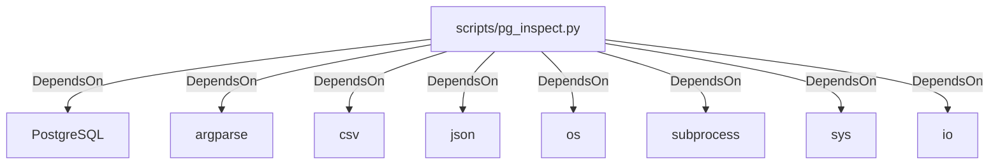

# Architecture

## Components

- **Document**: 5
- **File**: 36
- **Person**: 1
- **PythonModule**: 7 — see [API.md](API.md)
- **PythonSymbol**: 13 — see [API.md](API.md)
- **Section**: 66
- **Technology**: 1 — see below, `## Technologies`

## Crate & Workspace Topology

_No crate/workspace manifests compiled._

## Technologies

- **PostgreSQL** — used by: scripts/pg_inspect.py

## CI/CD Pipelines

_No CI/CD pipeline definitions compiled._

## Entity Relationships

_No table foreign-key relationships compiled._

## Dependency Graph

### Contains

_79 `Contains` relationships compiled — diagram omitted, too large to render usefully. First 15 shown below; every object's own detail page (linked) lists its full relationship set._

- CLAUDE.md → CLAUDE.md: section 1
- CLAUDE.md → CLAUDE.md: section 2
- CLAUDE.md → CLAUDE.md: section 3
- CLAUDE.md → CLAUDE.md: section 4
- CLAUDE.md → CLAUDE.md: section 5
- CLAUDE.md → CLAUDE.md: section 6
- CLAUDE.md → CLAUDE.md: section 7
- CLAUDE.md → CLAUDE.md: section 8
- CLAUDE.md → CLAUDE.md: section 9
- CLAUDE.md → CLAUDE.md: section 10
- CLAUDE.md → CLAUDE.md: section 11
- CLAUDE.md → CLAUDE.md: section 12
- CLAUDE.md → CLAUDE.md: section 13
- CLAUDE.md → CLAUDE.md: section 14
- devlog_4.md → devlog_4.md: section 1

### CoupledWith

_26 `CoupledWith` relationships compiled — diagram omitted, too large to render usefully. First 15 shown below; every object's own detail page (linked) lists its full relationship set._

- CLAUDE.md → README.md
- README.md → azure-pipelines.yml
- metadata/ingestion/pgsql_to_adls_incremental.json → pipeline/pl_dvdrental_incremental_pgsql_adls.json
- pipeline/pl_dvdrental_incremental_entity_pgsql_adls.json → pipeline/pl_dvdrental_incremental_pgsql_adls.json
- pipeline/pl_dvdrental_copy_entity_pgsql_adls.json → pipeline/pl_dvdrental_incremental_pgsql_adls.json
- pipeline/pl_dvdrental_copy_entity_pgsql_adls.json → pipeline/pl_dvdrental_ingest_pgsql_adls.json
- pipeline/pl_dvdrental_copy_entity_pgsql_adls.json → pipeline/pl_dvdrental_incremental_entity_pgsql_adls.json
- README.md → parameters/parameters.test.json
- parameters/parameters.prod.json → parameters/parameters.test.json
- arm-template-parameters-definition.json → azure-pipelines.yml
- README.md → parameters/parameters.dev.json
- azure-pipelines.yml → parameters/parameters.dev.json
- parameters/parameters.dev.json → parameters/parameters.test.json
- README.md → parameters/parameters.prod.json
- azure-pipelines.yml → parameters/parameters.test.json

### DependsOn

### OwnedBy

_43 `OwnedBy` relationships compiled — diagram omitted, too large to render usefully. First 15 shown below; every object's own detail page (linked) lists its full relationship set._

- unknown → Aleksei Banaev
- unknown → Aleksei Banaev
- unknown → Aleksei Banaev
- unknown → Aleksei Banaev
- unknown → Aleksei Banaev
- unknown → Aleksei Banaev
- unknown → Aleksei Banaev
- unknown → Aleksei Banaev
- unknown → Aleksei Banaev
- unknown → Aleksei Banaev
- unknown → Aleksei Banaev
- unknown → Aleksei Banaev
- unknown → Aleksei Banaev
- unknown → Aleksei Banaev
- unknown → Aleksei Banaev

