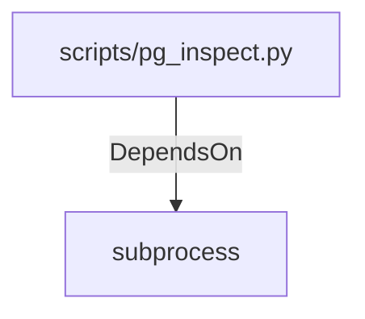

# subprocess (PythonModule)

## Properties

_No compiled properties._

## Relationships

### DependsOn

- ← scripts/pg_inspect.py (`edb7dd60-dbd0-554c-94b1-d520028d1862`)

## Diagram

## Evidence

_No evidence cited._
