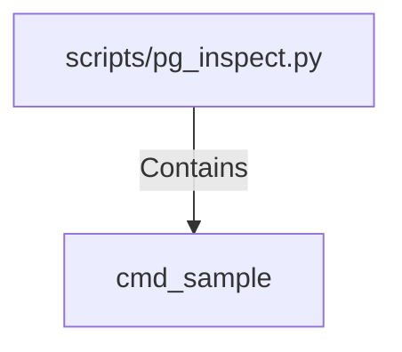

# cmd_sample (PythonSymbol)

## Properties

| Key | Value |
|---|---|
| `kind` | function |

## Relationships

### Contains

- ← scripts/pg_inspect.py (`edb7dd60-dbd0-554c-94b1-d520028d1862`)

## Diagram

## Evidence

_No evidence cited._
