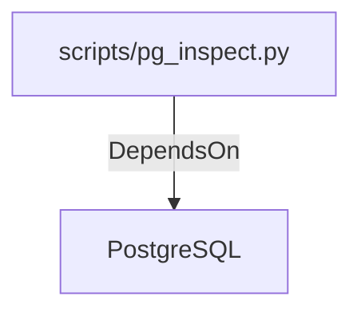

# PostgreSQL (Technology)

## Properties

_No compiled properties._

## Relationships

### DependsOn

- ← scripts/pg_inspect.py (`edb7dd60-dbd0-554c-94b1-d520028d1862`) — evidence: scripts/pg_inspect.py references PostgreSQL

## Diagram

## Evidence

- `ebc8fd3a-5284-4103-8998-8051d0463574` — scripts/pg_inspect.py references PostgreSQL (confidence: 1.00)
