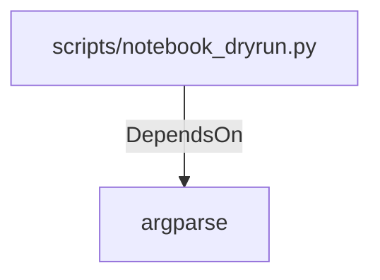

# argparse (PythonModule)

## Properties

_No compiled properties._

## Relationships

### DependsOn

- ← scripts/notebook_dryrun.py (`ec7d626d-1aa5-50d1-87d3-7507d485a8c5`)

## Diagram

## Evidence

_No evidence cited._
