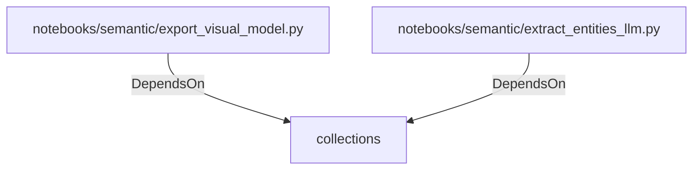

# collections (PythonModule)

## Properties

_No compiled properties._

## Relationships

### DependsOn

- ← notebooks/semantic/export_visual_model.py (`456cc917-5699-5196-84ae-381a044b53fc`)
- ← notebooks/semantic/extract_entities_llm.py (`351ba344-3c6e-525f-a2bd-77ca36cfcd79`)

## Diagram

## Evidence

_No evidence cited._
