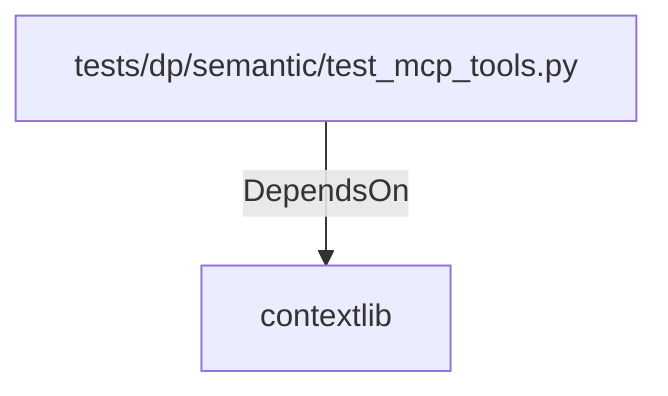

# contextlib (PythonModule)

## Properties

_No compiled properties._

## Relationships

### DependsOn

- ← tests/dp/semantic/test_mcp_tools.py (`4f73df62-9377-53aa-a84c-60d87949ad41`)

## Diagram

## Evidence

_No evidence cited._
