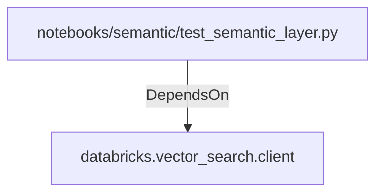

# databricks.vector_search.client (PythonModule)

## Properties

_No compiled properties._

## Relationships

### DependsOn

- ← notebooks/semantic/test_semantic_layer.py (`4de946b6-e51d-5c63-9cf2-4a44984b10a0`)

## Diagram

## Evidence

_No evidence cited._
