# dp.io.delta (PythonModule)

## Properties

_No compiled properties._

## Relationships

### DependsOn

- ← notebooks/semantic/load_ontology.py (`50682566-d5f6-5ae2-8784-a10e2cff5f73`)
- ← notebooks/semantic/extract_entities_llm.py (`351ba344-3c6e-525f-a2bd-77ca36cfcd79`)
- ← notebooks/semantic/load_semantic_metadata.py (`f967574f-24a0-591e-b91b-87bf29ef73fb`)
- ← notebooks/semantic/generate_attribute_metadata.py (`6cef00aa-8bdc-577f-ba7a-dce4f2e1113e`)
- ← notebooks/semantic/load_business_rules.py (`de9f535f-6a60-5fc1-916a-ce8a2668bd59`)
- ← notebooks/bronze/dvdrental/generic_raw_to_bronze.py (`93be948b-dba2-52c8-8c61-f506ab2c4273`)
- ← notebooks/semantic/load_documents.py (`28bfa6a8-c797-59c1-bad8-77fd49dbb1d6`)
- ← src/dp/quality/reporter.py (`380d8a0e-916c-59ea-b799-31bb40f34ed1`)

## Diagram

```mermaid
graph TD
    na855cffa5c1b5f53a8fb207bf32c27d0["dp.io.delta"]
    n50682566d5f65ae28784a10e2cff5f73["notebooks/semantic/load_ontology.py"]
    n50682566d5f65ae28784a10e2cff5f73 -->|DependsOn| na855cffa5c1b5f53a8fb207bf32c27d0
    n351ba3443c6e525fa2bd77ca36cfcd79["notebooks/semantic/extract_entities_llm.py"]
    n351ba3443c6e525fa2bd77ca36cfcd79 -->|DependsOn| na855cffa5c1b5f53a8fb207bf32c27d0
    nf967574f24a0591eb91b87bf29ef73fb["notebooks/semantic/load_semantic_metadata.py"]
    nf967574f24a0591eb91b87bf29ef73fb -->|DependsOn| na855cffa5c1b5f53a8fb207bf32c27d0
    n6cef00aa8bdc577fba7adce4f2e1113e["notebooks/semantic/generate_attribute_metadata.py"]
    n6cef00aa8bdc577fba7adce4f2e1113e -->|DependsOn| na855cffa5c1b5f53a8fb207bf32c27d0
    nde9f535f6a605fc1916ace8a2668bd59["notebooks/semantic/load_business_rules.py"]
    nde9f535f6a605fc1916ace8a2668bd59 -->|DependsOn| na855cffa5c1b5f53a8fb207bf32c27d0
    n93be948bdba252c88c61f506ab2c4273["notebooks/bronze/dvdrental/generic_raw_to_bronze.py"]
    n93be948bdba252c88c61f506ab2c4273 -->|DependsOn| na855cffa5c1b5f53a8fb207bf32c27d0
    n28bfa6a8c79759c1bad877fd49dbb1d6["notebooks/semantic/load_documents.py"]
    n28bfa6a8c79759c1bad877fd49dbb1d6 -->|DependsOn| na855cffa5c1b5f53a8fb207bf32c27d0
    n380d8a0e916c59eab79931bb40f34ed1["src/dp/quality/reporter.py"]
    n380d8a0e916c59eab79931bb40f34ed1 -->|DependsOn| na855cffa5c1b5f53a8fb207bf32c27d0
```

## Evidence

_No evidence cited._
