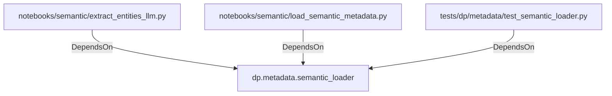

# dp.metadata.semantic_loader (PythonModule)

## Properties

_No compiled properties._

## Relationships

### DependsOn

- ← notebooks/semantic/extract_entities_llm.py (`351ba344-3c6e-525f-a2bd-77ca36cfcd79`)
- ← notebooks/semantic/load_semantic_metadata.py (`f967574f-24a0-591e-b91b-87bf29ef73fb`)
- ← tests/dp/metadata/test_semantic_loader.py (`076a9cd4-9ae9-544f-b387-fa6e08ed64a5`)

## Diagram

## Evidence

_No evidence cited._
