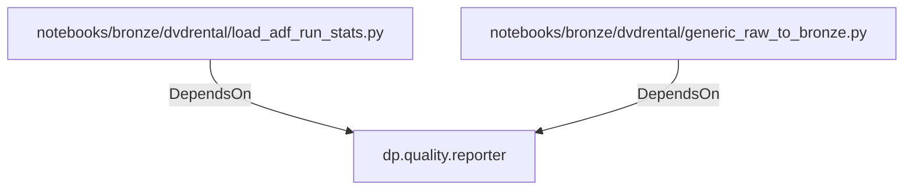

# dp.quality.reporter (PythonModule)

## Properties

_No compiled properties._

## Relationships

### DependsOn

- ← notebooks/bronze/dvdrental/load_adf_run_stats.py (`1f10f723-f696-5ecf-b10b-7d22186567a8`)
- ← notebooks/bronze/dvdrental/generic_raw_to_bronze.py (`93be948b-dba2-52c8-8c61-f506ab2c4273`)

## Diagram

## Evidence

_No evidence cited._
