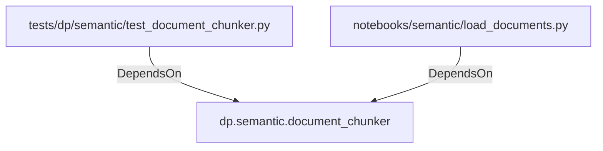

# dp.semantic.document_chunker (PythonModule)

## Properties

_No compiled properties._

## Relationships

### DependsOn

- ← tests/dp/semantic/test_document_chunker.py (`6ba5d553-ee39-50fb-a5f3-039f8e60b053`)
- ← notebooks/semantic/load_documents.py (`28bfa6a8-c797-59c1-bad8-77fd49dbb1d6`)

## Diagram

## Evidence

_No evidence cited._
