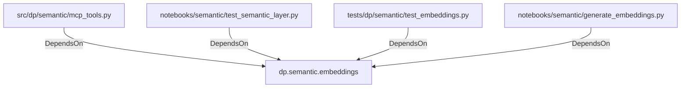

# dp.semantic.embeddings (PythonModule)

## Properties

_No compiled properties._

## Relationships

### DependsOn

- ← src/dp/semantic/mcp_tools.py (`9662dc12-d944-55cb-be77-7dbe15265ee7`)
- ← notebooks/semantic/test_semantic_layer.py (`4de946b6-e51d-5c63-9cf2-4a44984b10a0`)
- ← tests/dp/semantic/test_embeddings.py (`f38bdced-79b6-5ffe-b348-628b531e66dc`)
- ← notebooks/semantic/generate_embeddings.py (`7712f37f-7552-50a2-bddd-5edff5fda595`)

## Diagram

## Evidence

_No evidence cited._
