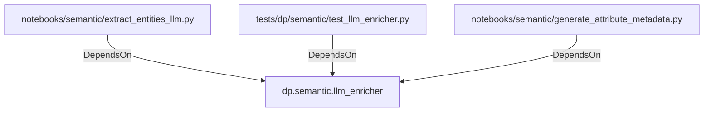

# dp.semantic.llm_enricher (PythonModule)

## Properties

_No compiled properties._

## Relationships

### DependsOn

- ← notebooks/semantic/extract_entities_llm.py (`351ba344-3c6e-525f-a2bd-77ca36cfcd79`)
- ← tests/dp/semantic/test_llm_enricher.py (`4c45abca-060e-5aeb-9f0d-7c5480cad37a`)
- ← notebooks/semantic/generate_attribute_metadata.py (`6cef00aa-8bdc-577f-ba7a-dce4f2e1113e`)

## Diagram

## Evidence

_No evidence cited._
