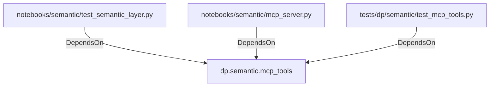

# dp.semantic.mcp_tools (PythonModule)

## Properties

_No compiled properties._

## Relationships

### DependsOn

- ← notebooks/semantic/test_semantic_layer.py (`4de946b6-e51d-5c63-9cf2-4a44984b10a0`)
- ← notebooks/semantic/mcp_server.py (`a7d3ec87-640d-5341-8428-411519605e05`)
- ← tests/dp/semantic/test_mcp_tools.py (`4f73df62-9377-53aa-a84c-60d87949ad41`)

## Diagram

## Evidence

_No evidence cited._
