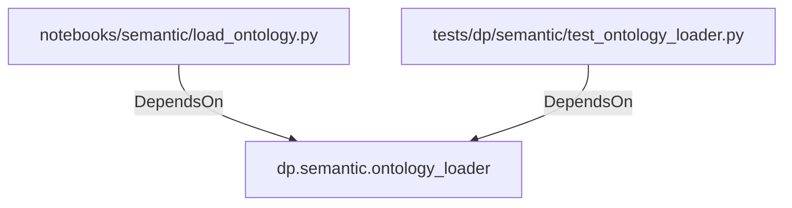

# dp.semantic.ontology_loader (PythonModule)

## Properties

_No compiled properties._

## Relationships

### DependsOn

- ← notebooks/semantic/load_ontology.py (`50682566-d5f6-5ae2-8784-a10e2cff5f73`)
- ← tests/dp/semantic/test_ontology_loader.py (`7c2568ce-fb4f-5d12-9f63-74471fff8cd8`)

## Diagram

## Evidence

_No evidence cited._
