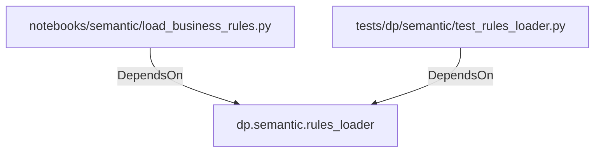

# dp.semantic.rules_loader (PythonModule)

## Properties

_No compiled properties._

## Relationships

### DependsOn

- ← notebooks/semantic/load_business_rules.py (`de9f535f-6a60-5fc1-916a-ce8a2668bd59`)
- ← tests/dp/semantic/test_rules_loader.py (`11db8d26-0218-542a-9518-c5304931957b`)

## Diagram

## Evidence

_No evidence cited._
