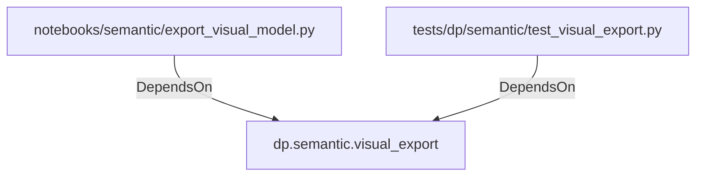

# dp.semantic.visual_export (PythonModule)

## Properties

_No compiled properties._

## Relationships

### DependsOn

- ← notebooks/semantic/export_visual_model.py (`456cc917-5699-5196-84ae-381a044b53fc`)
- ← tests/dp/semantic/test_visual_export.py (`cfab3f85-2d5b-525a-9011-ea372ea9a2c8`)

## Diagram

## Evidence

_No evidence cited._
