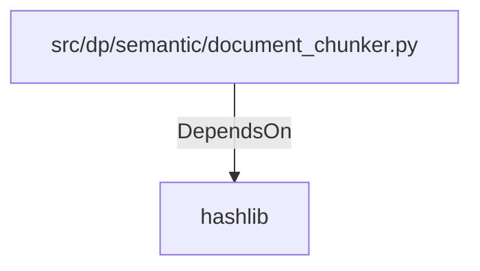

# hashlib (PythonModule)

## Properties

_No compiled properties._

## Relationships

### DependsOn

- ← src/dp/semantic/document_chunker.py (`b2e01fee-7a48-5250-94a8-a5530bff27e0`)

## Diagram

## Evidence

_No evidence cited._
