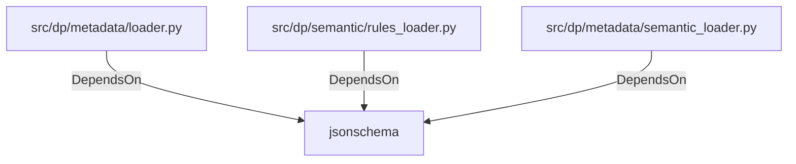

# jsonschema (PythonModule)

## Properties

_No compiled properties._

## Relationships

### DependsOn

- ← src/dp/metadata/loader.py (`b92f5925-3f28-5b8c-9321-0b8eaf210175`)
- ← src/dp/semantic/rules_loader.py (`cc6dd1ee-9468-5cc7-bdfc-a9fb90788414`)
- ← src/dp/metadata/semantic_loader.py (`eb3d03f1-86cf-5447-97d5-b158faf663df`)

## Diagram

## Evidence

_No evidence cited._
