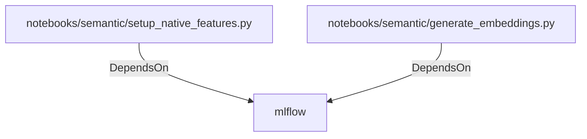

# mlflow (PythonModule)

## Properties

_No compiled properties._

## Relationships

### DependsOn

- ← notebooks/semantic/setup_native_features.py (`9d4db4e6-d282-5c2b-9b6e-601f0dfbd9ce`)
- ← notebooks/semantic/generate_embeddings.py (`7712f37f-7552-50a2-bddd-5edff5fda595`)

## Diagram

## Evidence

_No evidence cited._
