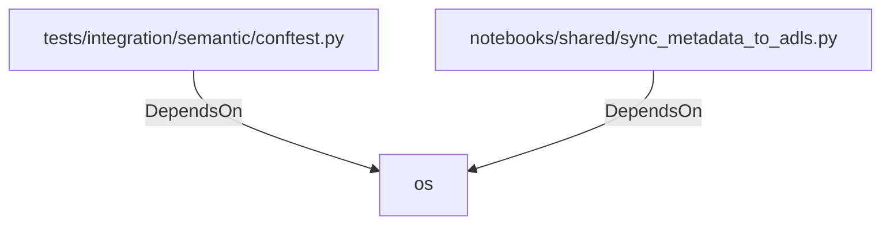

# os (PythonModule)

## Properties

_No compiled properties._

## Relationships

### DependsOn

- ← tests/integration/semantic/conftest.py (`f3bf6620-d61a-56a2-b193-843d3308ae7f`)
- ← notebooks/shared/sync_metadata_to_adls.py (`54e400db-725e-5f80-addd-78ab4f7d512a`)

## Diagram

## Evidence

_No evidence cited._
