# pyspark.sql.types (PythonModule)

## Properties

_No compiled properties._

## Relationships

### DependsOn

- ← src/dp/semantic/graph.py (`efdc0993-b53b-5997-a832-81d4347f2dd8`)
- ← notebooks/semantic/load_ontology.py (`50682566-d5f6-5ae2-8784-a10e2cff5f73`)
- ← notebooks/semantic/extract_entities_llm.py (`351ba344-3c6e-525f-a2bd-77ca36cfcd79`)
- ← src/dp/quality/reconciliation.py (`8e9bf929-9c71-5ff4-b679-ab1530deb6b4`)
- ← src/dp/io/table.py (`16eb1a72-8fe3-547f-93bc-158d68367ce8`)
- ← notebooks/semantic/load_semantic_metadata.py (`f967574f-24a0-591e-b91b-87bf29ef73fb`)
- ← tests/dp/transforms/test_schema.py (`7e43ef28-b57c-53b8-868a-a1d14777bade`)
- ← notebooks/semantic/generate_attribute_metadata.py (`6cef00aa-8bdc-577f-ba7a-dce4f2e1113e`)
- ← notebooks/semantic/load_business_rules.py (`de9f535f-6a60-5fc1-916a-ce8a2668bd59`)
- ← src/dp/io/run_stats.py (`b58b935d-2918-5656-97b3-dad504a9e27c`)
- ← notebooks/semantic/load_documents.py (`28bfa6a8-c797-59c1-bad8-77fd49dbb1d6`)
- ← src/dp/transforms/schema.py (`7e29d739-eb56-5fc1-b3e8-6ee53d0620ed`)
- ← src/dp/quality/reporter.py (`380d8a0e-916c-59ea-b799-31bb40f34ed1`)

## Diagram

```mermaid
graph TD
    n004aab6d789b51c2a3710bf1794462a3["pyspark.sql.types"]
    nefdc0993b53b5997a83281d4347f2dd8["src/dp/semantic/graph.py"]
    nefdc0993b53b5997a83281d4347f2dd8 -->|DependsOn| n004aab6d789b51c2a3710bf1794462a3
    n50682566d5f65ae28784a10e2cff5f73["notebooks/semantic/load_ontology.py"]
    n50682566d5f65ae28784a10e2cff5f73 -->|DependsOn| n004aab6d789b51c2a3710bf1794462a3
    n351ba3443c6e525fa2bd77ca36cfcd79["notebooks/semantic/extract_entities_llm.py"]
    n351ba3443c6e525fa2bd77ca36cfcd79 -->|DependsOn| n004aab6d789b51c2a3710bf1794462a3
    n8e9bf9299c715ff4b679ab1530deb6b4["src/dp/quality/reconciliation.py"]
    n8e9bf9299c715ff4b679ab1530deb6b4 -->|DependsOn| n004aab6d789b51c2a3710bf1794462a3
    n16eb1a728fe3547f93bc158d68367ce8["src/dp/io/table.py"]
    n16eb1a728fe3547f93bc158d68367ce8 -->|DependsOn| n004aab6d789b51c2a3710bf1794462a3
    nf967574f24a0591eb91b87bf29ef73fb["notebooks/semantic/load_semantic_metadata.py"]
    nf967574f24a0591eb91b87bf29ef73fb -->|DependsOn| n004aab6d789b51c2a3710bf1794462a3
    n7e43ef28b57c53b8868aa1d14777bade["tests/dp/transforms/test_schema.py"]
    n7e43ef28b57c53b8868aa1d14777bade -->|DependsOn| n004aab6d789b51c2a3710bf1794462a3
    n6cef00aa8bdc577fba7adce4f2e1113e["notebooks/semantic/generate_attribute_metadata.py"]
    n6cef00aa8bdc577fba7adce4f2e1113e -->|DependsOn| n004aab6d789b51c2a3710bf1794462a3
    nde9f535f6a605fc1916ace8a2668bd59["notebooks/semantic/load_business_rules.py"]
    nde9f535f6a605fc1916ace8a2668bd59 -->|DependsOn| n004aab6d789b51c2a3710bf1794462a3
    nb58b935d2918565697b3dad504a9e27c["src/dp/io/run_stats.py"]
    nb58b935d2918565697b3dad504a9e27c -->|DependsOn| n004aab6d789b51c2a3710bf1794462a3
    n28bfa6a8c79759c1bad877fd49dbb1d6["notebooks/semantic/load_documents.py"]
    n28bfa6a8c79759c1bad877fd49dbb1d6 -->|DependsOn| n004aab6d789b51c2a3710bf1794462a3
    n7e29d739eb565fc1b3e86ee53d0620ed["src/dp/transforms/schema.py"]
    n7e29d739eb565fc1b3e86ee53d0620ed -->|DependsOn| n004aab6d789b51c2a3710bf1794462a3
    n380d8a0e916c59eab79931bb40f34ed1["src/dp/quality/reporter.py"]
    n380d8a0e916c59eab79931bb40f34ed1 -->|DependsOn| n004aab6d789b51c2a3710bf1794462a3
```

## Evidence

_No evidence cited._
