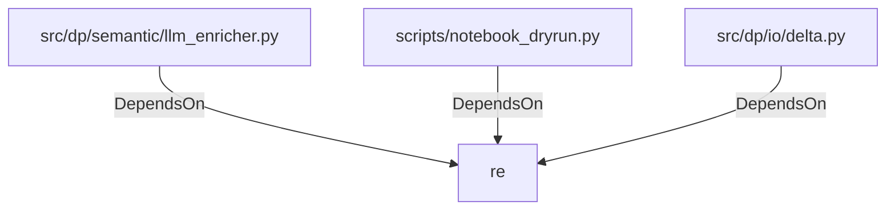

# re (PythonModule)

## Properties

_No compiled properties._

## Relationships

### DependsOn

- ← src/dp/semantic/llm_enricher.py (`48cbaf39-e0fa-5dfb-b7f9-3c29241145c1`)
- ← scripts/notebook_dryrun.py (`ec7d626d-1aa5-50d1-87d3-7507d485a8c5`)
- ← src/dp/io/delta.py (`31c42960-32c1-571b-acd7-a22fcdb34ad7`)

## Diagram

## Evidence

_No evidence cited._
