# sys (PythonModule)

## Properties

_No compiled properties._

## Relationships

### DependsOn

- ← notebooks/semantic/create_graph_views.py (`6959bd2f-54f2-5e78-9854-0280e441e28b`)
- ← notebooks/semantic/test_semantic_layer.py (`4de946b6-e51d-5c63-9cf2-4a44984b10a0`)
- ← notebooks/semantic/load_semantic_metadata.py (`f967574f-24a0-591e-b91b-87bf29ef73fb`)
- ← scripts/notebook_dryrun.py (`ec7d626d-1aa5-50d1-87d3-7507d485a8c5`)
- ← notebooks/bronze/dvdrental/load_adf_run_stats.py (`1f10f723-f696-5ecf-b10b-7d22186567a8`)
- ← tests/dp/semantic/test_embeddings.py (`f38bdced-79b6-5ffe-b348-628b531e66dc`)
- ← tests/dp/semantic/test_mcp_tools.py (`4f73df62-9377-53aa-a84c-60d87949ad41`)
- ← notebooks/semantic/generate_embeddings.py (`7712f37f-7552-50a2-bddd-5edff5fda595`)
- ← notebooks/bronze/dvdrental/generic_raw_to_bronze.py (`93be948b-dba2-52c8-8c61-f506ab2c4273`)
- ← src/dp/utils/logger.py (`d41d6a36-dbba-5144-af8d-b2e842e02b18`)

## Diagram

```mermaid
graph TD
    n73a609fa02435a5cbe38bc73b816eccb["sys"]
    n6959bd2f54f25e7898540280e441e28b["notebooks/semantic/create_graph_views.py"]
    n6959bd2f54f25e7898540280e441e28b -->|DependsOn| n73a609fa02435a5cbe38bc73b816eccb
    n4de946b6e51d5c639cf24a44984b10a0["notebooks/semantic/test_semantic_layer.py"]
    n4de946b6e51d5c639cf24a44984b10a0 -->|DependsOn| n73a609fa02435a5cbe38bc73b816eccb
    nf967574f24a0591eb91b87bf29ef73fb["notebooks/semantic/load_semantic_metadata.py"]
    nf967574f24a0591eb91b87bf29ef73fb -->|DependsOn| n73a609fa02435a5cbe38bc73b816eccb
    nec7d626d1aa550d187d37507d485a8c5["scripts/notebook_dryrun.py"]
    nec7d626d1aa550d187d37507d485a8c5 -->|DependsOn| n73a609fa02435a5cbe38bc73b816eccb
    n1f10f723f6965ecfb10b7d22186567a8["notebooks/bronze/dvdrental/load_adf_run_stats.py"]
    n1f10f723f6965ecfb10b7d22186567a8 -->|DependsOn| n73a609fa02435a5cbe38bc73b816eccb
    nf38bdced79b65ffeb348628b531e66dc["tests/dp/semantic/test_embeddings.py"]
    nf38bdced79b65ffeb348628b531e66dc -->|DependsOn| n73a609fa02435a5cbe38bc73b816eccb
    n4f73df62937753aaa84c60d87949ad41["tests/dp/semantic/test_mcp_tools.py"]
    n4f73df62937753aaa84c60d87949ad41 -->|DependsOn| n73a609fa02435a5cbe38bc73b816eccb
    n7712f37f755250a2bddd5edff5fda595["notebooks/semantic/generate_embeddings.py"]
    n7712f37f755250a2bddd5edff5fda595 -->|DependsOn| n73a609fa02435a5cbe38bc73b816eccb
    n93be948bdba252c88c61f506ab2c4273["notebooks/bronze/dvdrental/generic_raw_to_bronze.py"]
    n93be948bdba252c88c61f506ab2c4273 -->|DependsOn| n73a609fa02435a5cbe38bc73b816eccb
    nd41d6a36dbba5144af8db2e842e02b18["src/dp/utils/logger.py"]
    nd41d6a36dbba5144af8db2e842e02b18 -->|DependsOn| n73a609fa02435a5cbe38bc73b816eccb
```

## Evidence

_No evidence cited._
