# typing (PythonModule)

## Properties

_No compiled properties._

## Relationships

### DependsOn

- ← src/dp/utils/secrets.py (`bd8c8fd8-994b-5892-ba79-aa497745742c`)
- ← src/dp/metadata/loader.py (`b92f5925-3f28-5b8c-9321-0b8eaf210175`)
- ← src/dp/semantic/mcp_tools.py (`9662dc12-d944-55cb-be77-7dbe15265ee7`)
- ← src/dp/semantic/rules_loader.py (`cc6dd1ee-9468-5cc7-bdfc-a9fb90788414`)
- ← src/dp/semantic/llm_enricher.py (`48cbaf39-e0fa-5dfb-b7f9-3c29241145c1`)
- ← src/dp/semantic/embeddings.py (`34150f72-e0dc-5a51-b139-e37151e4d394`)
- ← src/dp/metadata/semantic_loader.py (`eb3d03f1-86cf-5447-97d5-b158faf663df`)

## Diagram

```mermaid
graph TD
    nc29ec85b2a7b59168a28d2d5aa022a21["typing"]
    nbd8c8fd8994b5892ba79aa497745742c["src/dp/utils/secrets.py"]
    nbd8c8fd8994b5892ba79aa497745742c -->|DependsOn| nc29ec85b2a7b59168a28d2d5aa022a21
    nb92f59253f285b8c93210b8eaf210175["src/dp/metadata/loader.py"]
    nb92f59253f285b8c93210b8eaf210175 -->|DependsOn| nc29ec85b2a7b59168a28d2d5aa022a21
    n9662dc12d94455cbbe777dbe15265ee7["src/dp/semantic/mcp_tools.py"]
    n9662dc12d94455cbbe777dbe15265ee7 -->|DependsOn| nc29ec85b2a7b59168a28d2d5aa022a21
    ncc6dd1ee94685cc7bdfca9fb90788414["src/dp/semantic/rules_loader.py"]
    ncc6dd1ee94685cc7bdfca9fb90788414 -->|DependsOn| nc29ec85b2a7b59168a28d2d5aa022a21
    n48cbaf39e0fa5dfbb7f93c29241145c1["src/dp/semantic/llm_enricher.py"]
    n48cbaf39e0fa5dfbb7f93c29241145c1 -->|DependsOn| nc29ec85b2a7b59168a28d2d5aa022a21
    n34150f72e0dc5a51b139e37151e4d394["src/dp/semantic/embeddings.py"]
    n34150f72e0dc5a51b139e37151e4d394 -->|DependsOn| nc29ec85b2a7b59168a28d2d5aa022a21
    neb3d03f186cf544797d5b158faf663df["src/dp/metadata/semantic_loader.py"]
    neb3d03f186cf544797d5b158faf663df -->|DependsOn| nc29ec85b2a7b59168a28d2d5aa022a21
```

## Evidence

_No evidence cited._
