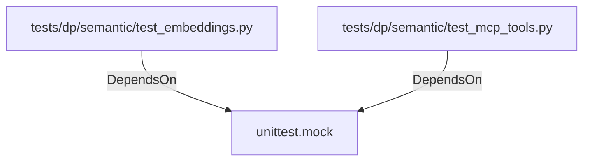

# unittest.mock (PythonModule)

## Properties

_No compiled properties._

## Relationships

### DependsOn

- ← tests/dp/semantic/test_embeddings.py (`f38bdced-79b6-5ffe-b348-628b531e66dc`)
- ← tests/dp/semantic/test_mcp_tools.py (`4f73df62-9377-53aa-a84c-60d87949ad41`)

## Diagram

## Evidence

_No evidence cited._
