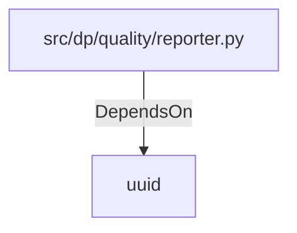

# uuid (PythonModule)

## Properties

_No compiled properties._

## Relationships

### DependsOn

- ← src/dp/quality/reporter.py (`380d8a0e-916c-59ea-b799-31bb40f34ed1`)

## Diagram

## Evidence

_No evidence cited._
