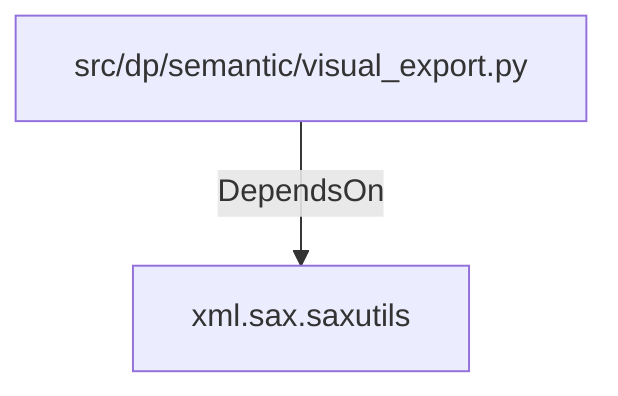

# xml.sax.saxutils (PythonModule)

## Properties

_No compiled properties._

## Relationships

### DependsOn

- ← src/dp/semantic/visual_export.py (`21f0a170-901b-56e4-be84-c03f122240f5`)

## Diagram

## Evidence

_No evidence cited._
