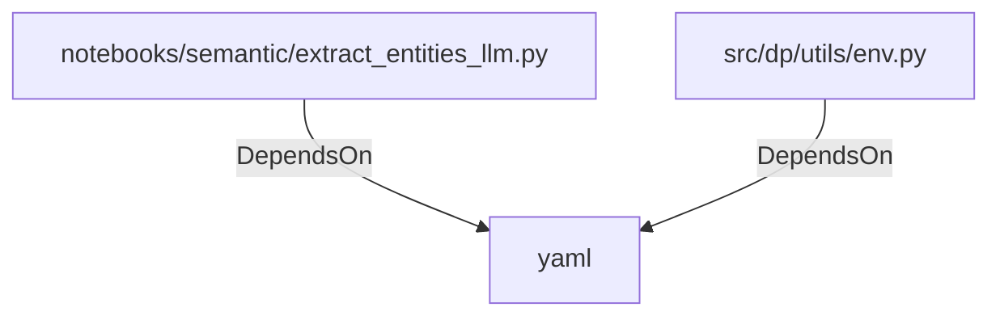

# yaml (PythonModule)

## Properties

_No compiled properties._

## Relationships

### DependsOn

- ← notebooks/semantic/extract_entities_llm.py (`351ba344-3c6e-525f-a2bd-77ca36cfcd79`)
- ← src/dp/utils/env.py (`29dd12ec-ab77-545d-b64a-7b7d2529ddcb`)

## Diagram

## Evidence

_No evidence cited._
