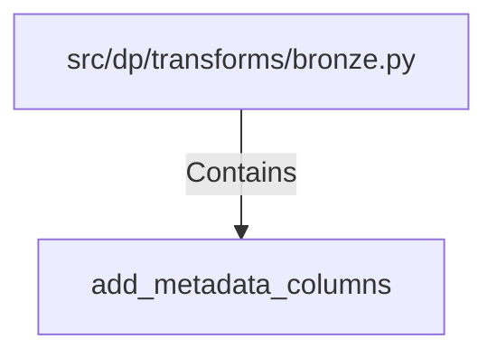

# add_metadata_columns (PythonSymbol)

## Properties

| Key | Value |
|---|---|
| `kind` | function |

## Relationships

### Contains

- ← src/dp/transforms/bronze.py (`4dd1b529-c566-5d54-afef-e7e6286314ca`)

## Diagram

## Evidence

_No evidence cited._
