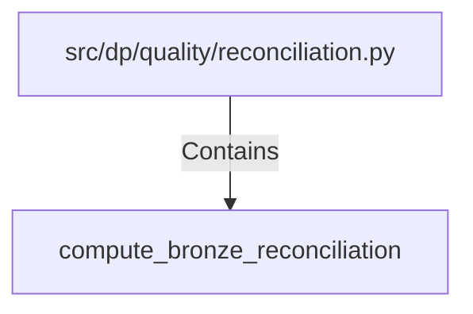

# compute_bronze_reconciliation (PythonSymbol)

## Properties

| Key | Value |
|---|---|
| `kind` | function |

## Relationships

### Contains

- ← src/dp/quality/reconciliation.py (`8e9bf929-9c71-5ff4-b679-ab1530deb6b4`)

## Diagram

## Evidence

_No evidence cited._
