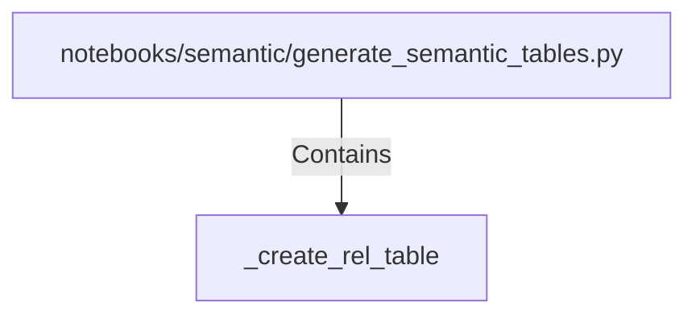

# _create_rel_table (PythonSymbol)

## Properties

| Key | Value |
|---|---|
| `kind` | function |

## Relationships

### Contains

- ← notebooks/semantic/generate_semantic_tables.py (`4c5a3b5b-087b-557e-b0e3-346cfa340acf`)

## Diagram

## Evidence

_No evidence cited._
