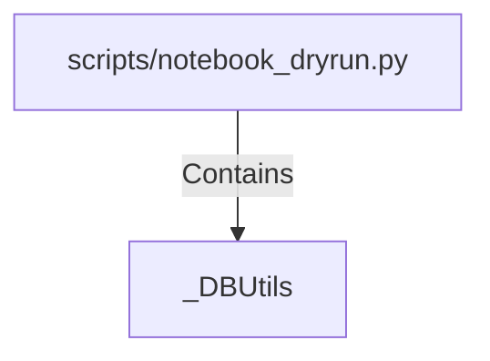

# _DBUtils (PythonSymbol)

## Properties

| Key | Value |
|---|---|
| `kind` | class |

## Relationships

### Contains

- ← scripts/notebook_dryrun.py (`ec7d626d-1aa5-50d1-87d3-7507d485a8c5`)

## Diagram

## Evidence

_No evidence cited._
