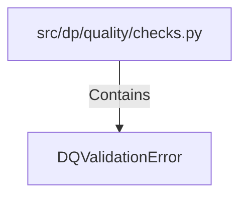

# DQValidationError (PythonSymbol)

## Properties

| Key | Value |
|---|---|
| `kind` | class |

## Relationships

### Contains

- ← src/dp/quality/checks.py (`7fa68776-5adc-5f58-94c3-7e455e4ad27d`)

## Diagram

## Evidence

_No evidence cited._
