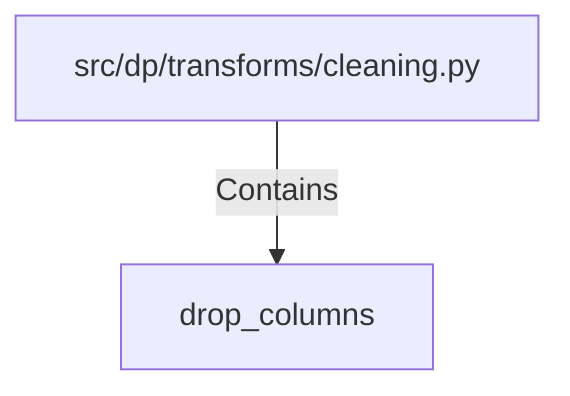

# drop_columns (PythonSymbol)

## Properties

| Key | Value |
|---|---|
| `kind` | function |

## Relationships

### Contains

- ← src/dp/transforms/cleaning.py (`ff9173c1-eae9-5f50-a2ee-d66c7b171805`)

## Diagram

## Evidence

_No evidence cited._
