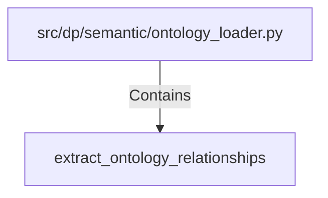

# extract_ontology_relationships (PythonSymbol)

## Properties

| Key | Value |
|---|---|
| `kind` | function |

## Relationships

### Contains

- ← src/dp/semantic/ontology_loader.py (`fc208e36-b1df-5a7d-91cf-efed6d59e68e`)

## Diagram

## Evidence

_No evidence cited._
