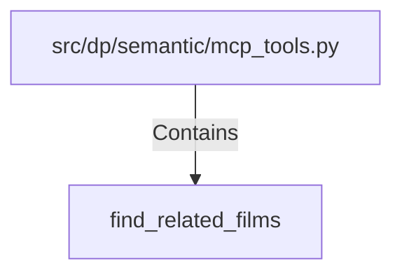

# find_related_films (PythonSymbol)

## Properties

| Key | Value |
|---|---|
| `kind` | function |

## Relationships

### Contains

- ← src/dp/semantic/mcp_tools.py (`9662dc12-d944-55cb-be77-7dbe15265ee7`)

## Diagram

## Evidence

_No evidence cited._
