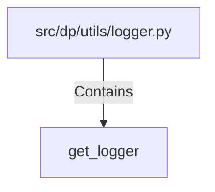

# get_logger (PythonSymbol)

## Properties

| Key | Value |
|---|---|
| `kind` | function |

## Relationships

### Contains

- ← src/dp/utils/logger.py (`d41d6a36-dbba-5144-af8d-b2e842e02b18`)

## Diagram

## Evidence

_No evidence cited._
