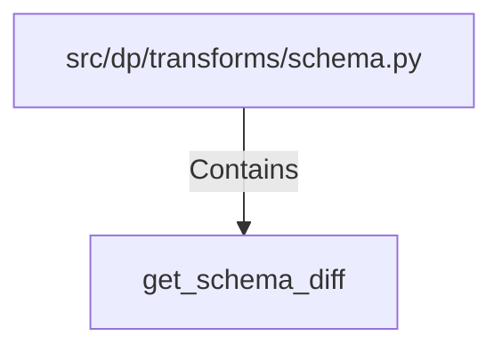

# get_schema_diff (PythonSymbol)

## Properties

| Key | Value |
|---|---|
| `kind` | function |

## Relationships

### Contains

- ← src/dp/transforms/schema.py (`7e29d739-eb56-5fc1-b3e8-6ee53d0620ed`)

## Diagram

## Evidence

_No evidence cited._
