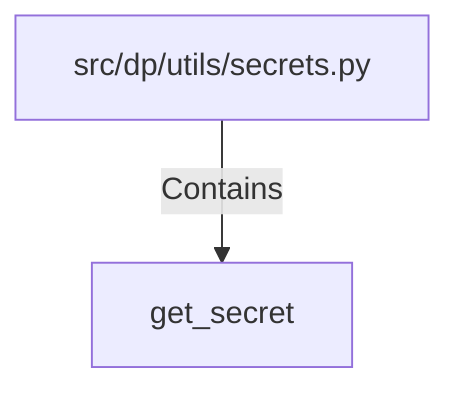

# get_secret (PythonSymbol)

## Properties

| Key | Value |
|---|---|
| `kind` | function |

## Relationships

### Contains

- ← src/dp/utils/secrets.py (`bd8c8fd8-994b-5892-ba79-aa497745742c`)

## Diagram

## Evidence

_No evidence cited._
