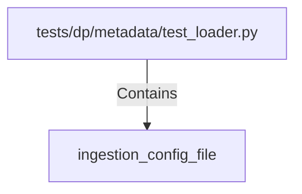

# ingestion_config_file (PythonSymbol)

## Properties

| Key | Value |
|---|---|
| `kind` | function |

## Relationships

### Contains

- ← tests/dp/metadata/test_loader.py (`460d2dcf-09f6-545f-897a-d0faece53ce1`)

## Diagram

## Evidence

_No evidence cited._
