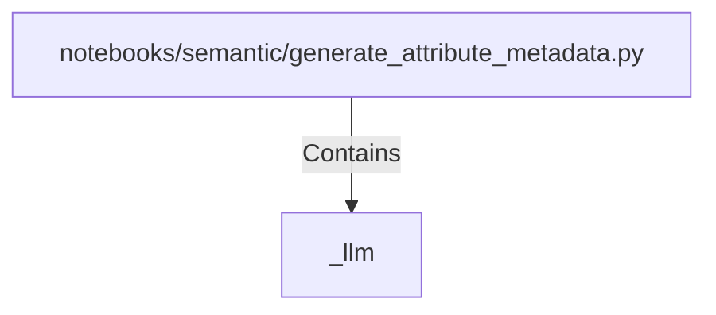

# _llm (PythonSymbol)

## Properties

| Key | Value |
|---|---|
| `kind` | function |

## Relationships

### Contains

- ← notebooks/semantic/generate_attribute_metadata.py (`6cef00aa-8bdc-577f-ba7a-dce4f2e1113e`)

## Diagram

## Evidence

_No evidence cited._
