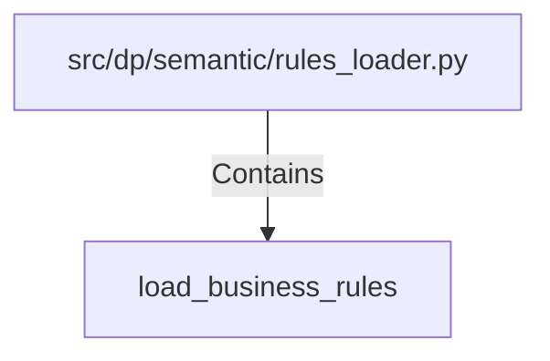

# load_business_rules (PythonSymbol)

## Properties

| Key | Value |
|---|---|
| `kind` | function |

## Relationships

### Contains

- ← src/dp/semantic/rules_loader.py (`cc6dd1ee-9468-5cc7-bdfc-a9fb90788414`)

## Diagram

## Evidence

_No evidence cited._
