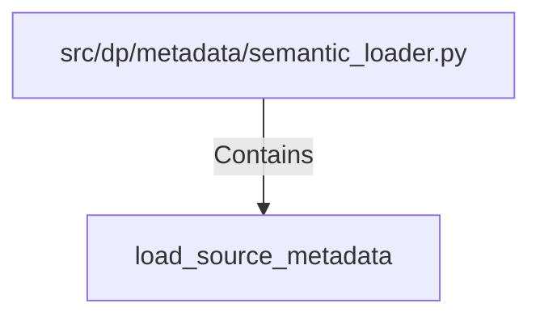

# load_source_metadata (PythonSymbol)

## Properties

| Key | Value |
|---|---|
| `kind` | function |

## Relationships

### Contains

- ← src/dp/metadata/semantic_loader.py (`eb3d03f1-86cf-5447-97d5-b158faf663df`)

## Diagram

## Evidence

_No evidence cited._
