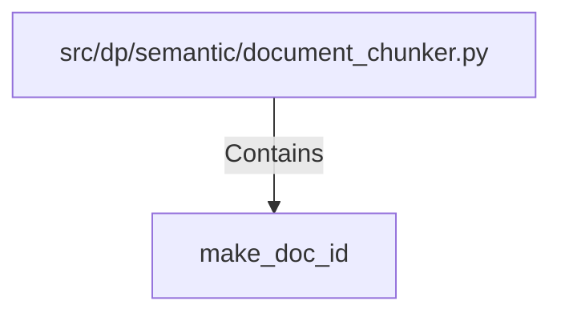

# make_doc_id (PythonSymbol)

## Properties

| Key | Value |
|---|---|
| `kind` | function |

## Relationships

### Contains

- ← src/dp/semantic/document_chunker.py (`b2e01fee-7a48-5250-94a8-a5530bff27e0`)

## Diagram

## Evidence

_No evidence cited._
