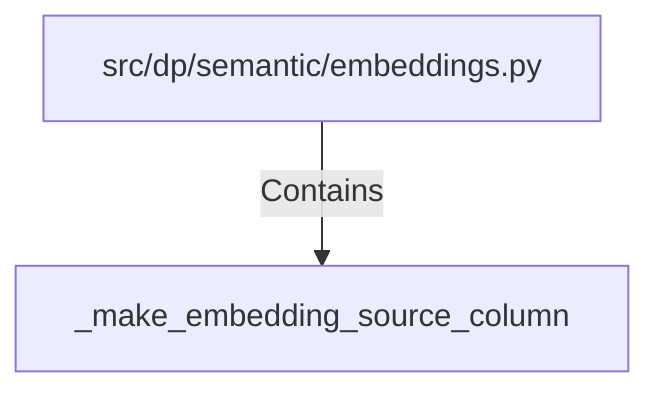

# _make_embedding_source_column (PythonSymbol)

## Properties

| Key | Value |
|---|---|
| `kind` | function |

## Relationships

### Contains

- ← src/dp/semantic/embeddings.py (`34150f72-e0dc-5a51-b139-e37151e4d394`)

## Diagram

## Evidence

_No evidence cited._
