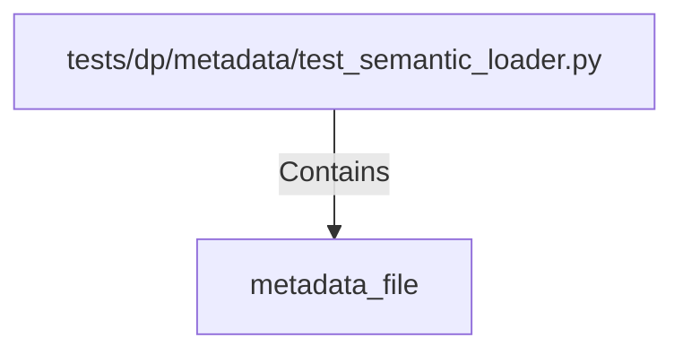

# metadata_file (PythonSymbol)

## Properties

| Key | Value |
|---|---|
| `kind` | function |

## Relationships

### Contains

- ← tests/dp/metadata/test_semantic_loader.py (`076a9cd4-9ae9-544f-b387-fa6e08ed64a5`)

## Diagram

## Evidence

_No evidence cited._
